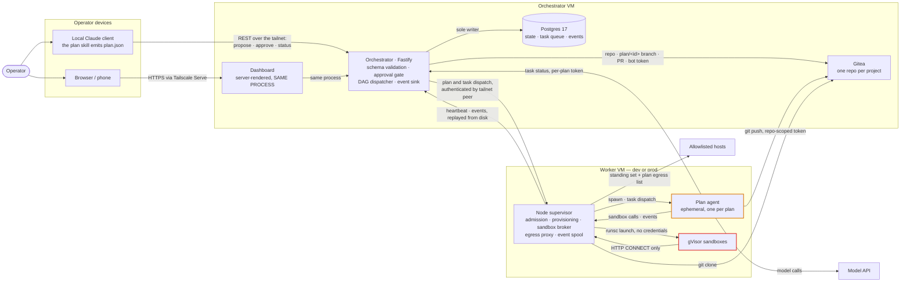
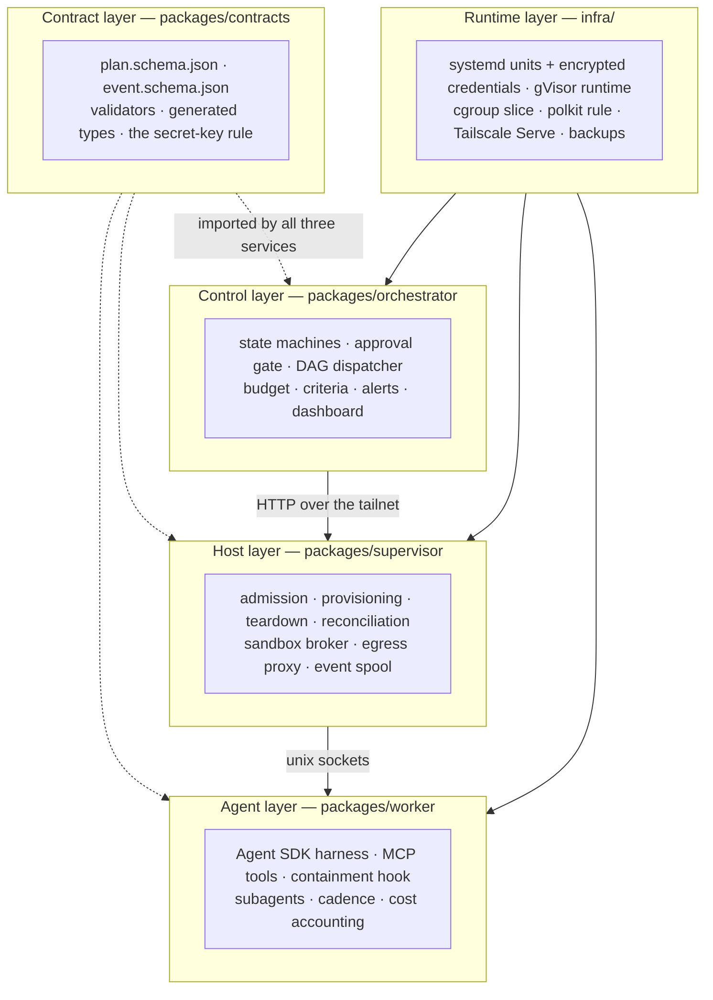

# 1 · System Overview

**Mycelium is a single-operator system for agentic software development, scraping and research.**
You plan conversationally in Claude Code, approve the plan, and it executes on a remote VM: an
LLM agent works through a task DAG, runs code in a gVisor sandbox, and commits to a branch. Every
tool call, limit and error is recorded append-only and visible in a dashboard on your phone.
Nothing is exposed to the public internet — **the tailnet is the perimeter.**

---

## 1.1 The four tiers



Stroke colour tracks the trust tiers: plain is trusted, amber is the semi-trusted plan agent, red
is the untrusted sandbox. **Note the edges the sandbox does *not* have** — no path to Gitea, the
orchestrator, or the model API, and no path out except through the supervisor.

| Tier | What it is | Key property |
| --- | --- | --- |
| **[Planning client](layers/planning-client.md)** | Claude Code + the `plan` skill, in `~/.claude/skills/plan/` — **not in this repo** | Holds no copy of the schema; it validates by submitting and reading the issues back |
| **[Orchestrator](layers/orchestrator.md)** | A deterministic Fastify service — **not an agent** | Postgres is its only state store; every database write in the system goes through it |
| **[Supervisor](layers/supervisor.md)** | One persistent daemon per worker VM | No LLM loop, no durable state beyond the spool and one secret-free record per plan |
| **[Plan agent](03-agentic-harness.md)** | An ephemeral process, one per approved plan | Runs the Claude Agent SDK. Assumed prompt-injectable — nothing in it is a containment boundary |
| **Sandbox** | A gVisor container, a *sibling* of the agent | Receives the working directory and nothing else. No credentials, no Docker socket |

---

## 1.2 Goals, and the design pressure each one applied

| # | Goal | What it forced |
| --- | --- | --- |
| **G1** | Plan locally, execute remotely | The plan skill lives outside this repo, so any Claude Code session can author |
| **G2** | **Nothing runs without explicit approval** | `approved_at` is a database column the dispatcher filters on — not a prompt convention |
| **G3** | Untrusted code never touches the host | Mandatory gVisor; the agent never gets the Docker socket |
| **G4** | Everything is observable | An append-only event log enforced by a database trigger |
| **G5** | Cheap — $50–200/month all in | Event-driven agents that **never poll an LLM while idle**; cost ceilings at three levels |
| **G6** | Portable | Tailscale abstracts the network; nothing binds a public interface |

---

## 1.3 Repository layout

```
packages/contracts/     the plan and event schemas, and their validators
packages/orchestrator/  the control plane: validation, approval, the DAG dispatcher,
                        events, the dashboard
packages/supervisor/    one daemon per worker VM: environments, the sandbox broker,
                        the egress proxy
packages/worker/        the plan agent: the Agent SDK runner, its tools, its cost budget
infra/                  systemd units, credentials, gVisor, Serve, the bring-up runbook
migrations/             Postgres DDL, numbered and roll-forward only
docs/                   this documentation set
```

**A pnpm workspace, TypeScript, ESM with NodeNext resolution** (so relative imports carry `.js`),
Node ≥ 22, strict everywhere including `noUncheckedIndexedAccess` and
`exactOptionalPropertyTypes`. Vitest runs from the repo root with `fileParallelism: false`,
because the orchestrator's integration tests share one Postgres database and truncate between
tests.

Four dependencies do the work: **Fastify** (both HTTP services), **`pg`** (Postgres),
**Ajv** (schema validation), **`@anthropic-ai/claude-agent-sdk`** + **Zod** (the agent).
There is no front-end build, no ORM, no message broker, and no chart library.

### Internal conventions worth knowing

- **`domain/` is pure and touches no database.** Every state machine, selection rule, budget
  calculation and alert predicate is a function you can call in a test with no fixtures.
- **Each service owns its own SQL. There is no repository layer.**
- **The dispatcher is one `tick()` function** that tests drive directly with an injected clock.
- **Drivers have interfaces and in-memory fakes** (B22) — containers, processes, cgroups, exec,
  git — so the default test run needs no Docker, no gVisor, and no network.

---

## 1.4 The layers, by concern



The contract layer is the only shared code. The orchestrator and supervisor deliberately keep
**hand-written copies** of the RPC envelope and the dispatch shape rather than importing them —
they are separately deployed, the shapes are a few lines, and a shared package would couple them
for no gain.

---

## 1.5 The decisions that shape everything else

Full reasoning lives in the baseline's decision table (B1–B22). The ones you need to read the
code:

| | Decision | Consequence you will see everywhere |
| --- | --- | --- |
| **B1** | The orchestrator is deterministic, not an agent | No LLM anywhere in the control plane |
| **B2** | Approval is a database precondition | `WHERE … AND approved_at IS NOT NULL` |
| **B3** | Postgres is queue, state, **and** event log | `FOR UPDATE SKIP LOCKED`, `LISTEN/NOTIFY` as a hint only |
| **B5** | Per-VM supervisor provisions ephemeral agents | Teardown *is* killing the environment |
| **B6** | Sandboxes are supervisor-brokered siblings | The agent holds no credential pointing at the sandbox |
| **B7** | Repo per project, `plan/<id>` branch, operator-merged PR | Agents never touch `main` |
| **B9** | *(reversed 2026-09)* the Agent SDK owns the loop | See [03 · Agentic Harness](03-agentic-harness.md) |
| **B12** | First-fit selection over healthy candidates | Selection is an optimisation; **rejection is the correctness mechanism** |
| **B13** | systemd encrypted credentials, one `loadSecret()` | The supervisor's own environment holds no secret to inherit |
| **B14** | Default-deny egress through a supervisor proxy | Network scope goes through the approval gate |
| **B15** | Teardown is SIGTERM, 5 s, SIGKILL — **no rescue push** | Uncommitted work is lost; commit cadence is the cure |
| **B16** | One orchestrator per database, by advisory lock | Fails loudly at boot rather than quietly under load |
| **B17** | A terminal task failure halts its plan | Siblings are cancelled; the plan still finalizes with a manifest |
| **B18** | Per-plan secrets live in process memory only | A restart re-mints rather than recovering |
| **B19** | The supervisor authenticates by tailnet peer address | Which is why it refuses to start on a wildcard bind |
| **B20** | The broker RPC is a unix socket, not localhost TCP | Filesystem permissions *are* the authorisation |
| **B21** | A supervisor is full at a static `MAX_ENVIRONMENTS` | One integer the operator can reason about |
| **B22** | Drivers behind interfaces with in-memory fakes | The default test run works on Windows |

---

## 1.6 Deliberately out of scope for v1

Each of these was specified in detail earlier and can be reintroduced once the baseline runs end
to end. Knowing what is *absent* explains a lot of what looks minimal:

- **Typed context capsules and content references.** A v1 task carries a plain-text description;
  large inputs live in the repo. (`future_work/context-management.md` is the archived design.)
- **Agent-spawned subtasks.** A v1 task DAG is **fixed at approval time**.
- **Scheduled or recurring runs, and pre-approved templates.** v1 plans are manual.
- **Supervisor-brokered external connections** (third-party APIs, external MCP servers). A v1
  agent gets the model API and Gitea, and nothing else.
- **Project lifecycle states, prod-tier gating, staging-to-results promotion.** A plan's output is
  a branch and a pull request; scrape results are committed as files.
- **Cross-VM agent-to-agent communication, multiple operators, public exposure.**
- **An MCP façade.** §4 names one so "any MCP-capable client" would work; it does not exist, so
  today that means Claude Code. A stdio shim over the skill's six calls would restore it in about
  a hundred lines.

---

## 1.7 Current status — read this before trusting anything

> **The system has never run a plan end to end.**
>
> Everything is built and tested — four packages, ~1,131 passing tests, the plan skill, and the
> dashboard. But every test is against a fake, a local Postgres, or a temporary git repository.
> `infra/` was written from the configuration the code reads and self-checked as far as a
> development machine allows.
>
> A first orchestrator + worker bring-up **has** happened and found fifteen distinct problems —
> a Docker config key, a removed Tailscale command, a missing polkit package, two genuine code
> bugs — all recorded and fixed. But ticket 16 §6.5's actual end-to-end smoke run, the real
> acceptance gate for the Agent SDK migration, **has not been performed.**

`infra/verify.sh` exists to make that discovery orderly rather than mysterious. It checks a host
role by role and prints **SKIP** — never a pass — for anything it cannot actually verify.

See [09 · Known Drift](09-known-drift.md) for the specific places where documentation and code
currently disagree.

---

## 1.8 Where to go next

| If you want to understand… | Read |
| --- | --- |
| How a plan travels through the system | [02 · Flow of Use](02-flow-of-use.md) |
| How the agent actually runs | [03 · Agentic Harness](03-agentic-harness.md) |
| What the agent knows and remembers | [04 · Context & Memory](04-context-and-memory.md) |
| What the agent can do | [05 · Custom Tools](05-custom-tools.md) |
| What stops it doing more | [06 · Guardrails](06-guardrails.md) |
| How success is judged | [07 · Evaluation](07-evaluation.md) |
| What is recorded and where it goes | [08 · Observability](08-observability.md) |
| A specific package in depth | [layers/](layers/) |
