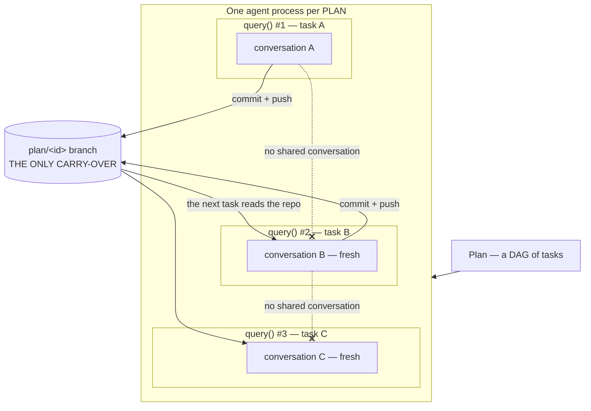
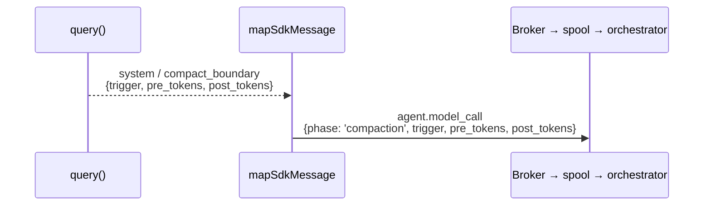
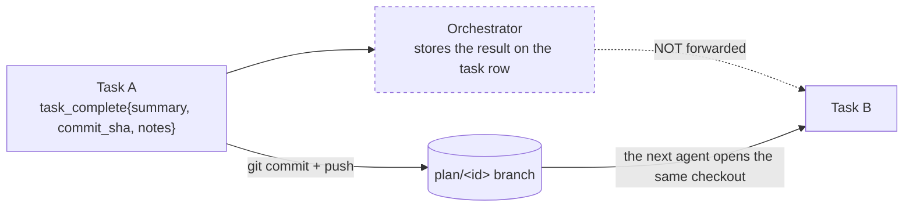
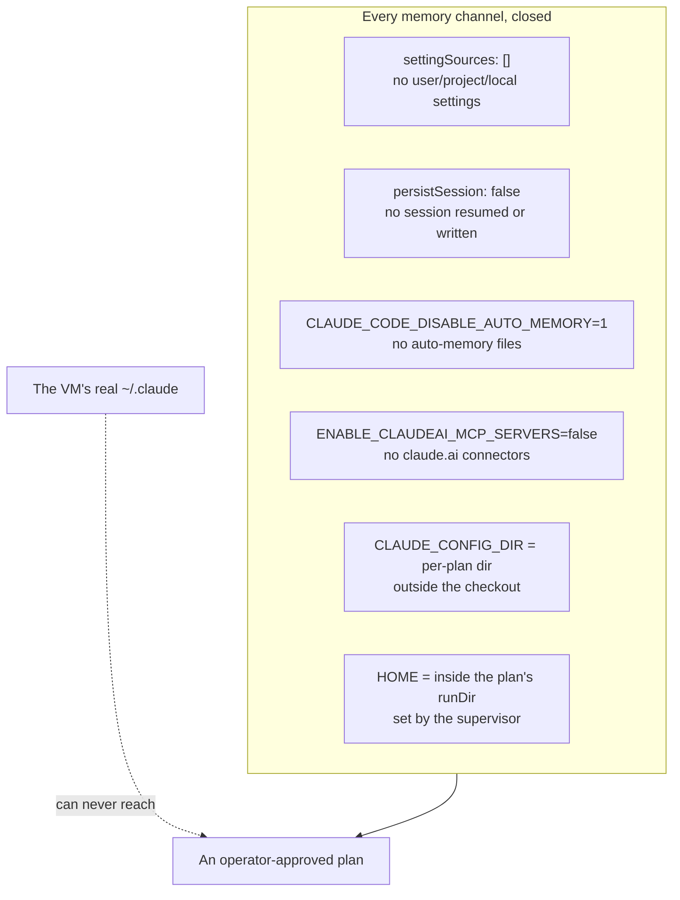

# 4 · Context & Memory

> **Short answer:** context is deliberately minimal and per-task; the SDK owns compaction; and
> **there is no agent memory at all.** The only thing that persists between tasks is the git
> branch. That is a design position, not a gap.

---

## 4.1 The scoping rule



| Scope | Lifetime | What lives there |
| --- | --- | --- |
| **Process** | one plan | credentials, sockets, the checkout, config |
| **`query()` call** | one task | the entire conversation, compaction history, subagent state |
| **Git branch** | beyond the plan | *everything that actually persists* |

The agent process runs **one task at a time**. Parallelism within a task is the SDK's
subagents, not concurrent tasks. `DispatchServer` refuses a second dispatch with
`{accepted: false}` while one is in flight, which the supervisor turns into a 409 and the
orchestrator turns back into a `ready` task.

---

## 4.2 What goes into a task's context

Everything, at the start of a task, is these two strings:

```
[system]  ~30 lines: identity, how you work, how a task ends, boundaries
[user]    Task <local_id>: <description>
          (+ "This is attempt N…" when execution_attempt > 1)
```

That is the whole seeded context. Notably **absent**:

| Not included | Why |
| --- | --- |
| The plan DAG | The agent cannot act on it, and it invites scope creep |
| Sibling task transcripts | Same |
| The event stream | Same |
| A repo listing / file tree | The model discovers the repo with `Glob`/`Grep`/`Read` |
| A git diff or status | Available on demand via the `git` tool |
| Upstream task results | **There is no field for them** — see §4.4 |

> *"Context it cannot act on is context that can only mislead it."* — `runner/prompt.ts`

The split is also a **caching** decision: the system prompt and tool declarations are
byte-identical across every turn of a task, so the cache breakpoint in front of them is worth
having. The volatile half goes after it.

---

## 4.3 Compaction — owned by the SDK, observed by the host

Context compaction is entirely internal to `query()`. Mycelium neither triggers nor tunes it.
What the host does is **watch** it: a `system` message with `subtype: 'compact_boundary'` is
mapped into an event so an operator can see it happen.



The event schema's `type` enum is **closed** (`additionalProperties: false`), so compaction
has no dedicated type — it rides `agent.model_call` under a `phase` key. That precedent is
then reused by all four subagent events, which ride `agent.tool_call` the same way.

Compaction has a second-order consequence the codebase calls out explicitly: it lets **far
more work accumulate between commits** than the old host loop ever allowed, which is precisely
why the commit-cadence instrument was reinstated ([03 §3.8](03-agentic-harness.md#38-the-commit-cadence-instrument)).

---

## 4.4 How work actually flows between tasks

There is exactly one channel, and it is the repository.



`task_complete` accepts a `notes` field described as *"Anything the next task should know"* —
and the orchestrator stores it. But **`TaskDispatch` carries no upstream-result field**, so
nothing feeds it back into the next task's prompt. Today `notes` is an operator-facing record,
not a machine-readable hand-off.

This is consistent with baseline §3's non-goals ("typed context capsules and content
references… large inputs live in the repo"), but it is worth knowing that the tool's own
description promises slightly more than the pipeline delivers. See
[09-known-drift.md](09-known-drift.md).

**The practical consequence for plan authors:** if task B needs something from task A, task A
must write it to a *file* and commit it. That is exactly why the plan skill tells operators to
turn "a written comparison" into `findings.md`.

---

## 4.5 Memory: deliberately none

Mycelium goes out of its way to ensure the agent has **no persistent memory whatsoever** —
not across tasks, not across plans, and above all not from the host machine.



**Why all six and not just one:** `settingSources: []` alone does *not* suppress auto-memory
or claude.ai connectors. The set is a package; removing any one of them reopens a channel.

**Why it matters:** approval is Mycelium's central guarantee (G2 — *nothing runs without
explicit approval*). A plan that could be influenced by whatever the host machine remembered
would be running something the operator never saw at the approval gate. Memory and the
approval gate are in direct tension, and the approval gate wins.

`CLAUDE_CONFIG_DIR` defaults to a **sibling** of the checkout named `claude-config` — never
*inside* it, because the checkout is the file tools' root and the tree bind-mounted into the
sandbox. In production the supervisor injects a real one nested in the plan's `runDir`.

### The one thing that does survive

**Pushed commits.** Nothing else. There is no rescue push on teardown (B15), so uncommitted
work in the working tree is lost when the environment goes away — which is why the system
prompt says *"Commit at every checkpoint… Push often"*, why `git` is a first-class tool, and
why the cadence instrument exists.

---

## 4.6 Where state actually lives, system-wide

The agent is stateless by design; durability is somebody else's job.

| Kind of state | Owner | Durability |
| --- | --- | --- |
| Conversation | the SDK, in memory | dies with the task |
| Task/plan state, DAG, leases | **Postgres**, written only by the orchestrator | durable |
| Events | supervisor's fsynced JSONL spool → Postgres `events` | durable, append-only |
| Per-plan secrets | orchestrator **process memory** only (B18) | re-minted after a restart |
| Per-plan environment record | supervisor, on disk, **secret-free** | survives a supervisor restart |
| Work product | the git branch, in Gitea | the only artifact of a plan |

Note the asymmetry that makes re-attachment possible: **the agent reports task status directly
to the orchestrator**, not through the supervisor. That is what lets a supervisor restart adopt
a live agent without recovering any in-flight task state — there is none to recover.

---

*Next: [05 · Custom Tools](05-custom-tools.md) · [06 · Guardrails](06-guardrails.md)*
