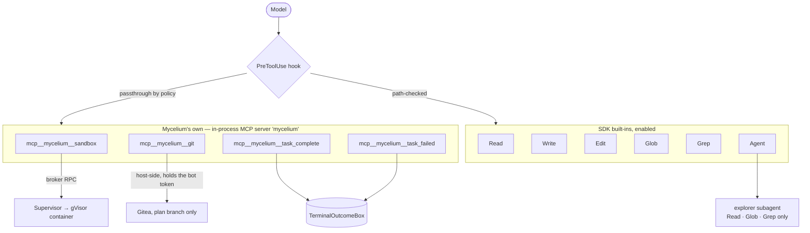
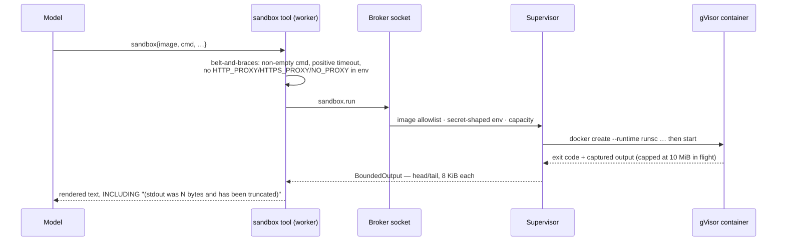
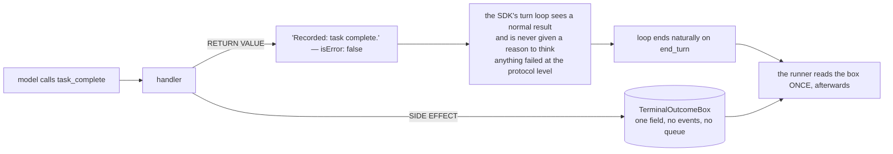

# 5 · Custom Tools

> **The agent's whole world is ten tools.** Four are Mycelium's own, exposed as an in-process MCP
> server; five are the SDK's built-in file tools, contained by a hook; one is the SDK's subagent
> spawner.

---

## 5.1 The full callable set



**Not enabled, deliberately:** `Bash` (see [06 · Guardrails](06-guardrails.md#4--the-tool-set--closed-and-missing-one-tool-on-purpose)),
and by omission `WebFetch`, `WebSearch`, `TodoWrite`, `NotebookEdit` and everything else in the
SDK's catalog. An omitted tool is *never even attempted* — `options.tools` restricts the model's
callable set, not a downstream permission check.

---

## 5.2 How the custom tools are declared

Zod schemas via `tool()`, assembled by `createSdkMcpServer()`, **built fresh per task** so the
outcome box and the closed-over `taskId` cannot leak from one task into the next.

Every shape is wrapped in **`z.strictObject`**:

```ts
function strictShape<Shape extends z.ZodRawShape>(shape: Shape): Shape {
  return z.strictObject(shape) as unknown as Shape;
}
```

A bare `z.object` **silently strips** unknown keys; `strictObject` rejects them. That preserves
the guarantee the previous hand-written Ajv `additionalProperties: false` gave — a call carrying
a property no schema declares is refused, not quietly trimmed.

> **Every object must be closed, recursively.** The first bring-up found that the Anthropic API
> strictly validates custom tool schemas and requires `additionalProperties: false` on *every*
> nested object. `sandbox`'s `env` was an open `{[k]: string}` map and `400`d before any work
> happened. It became a closed array of `{name, value}` pairs, and the test suite gained a
> **recursive** schema-closure check — the old one only checked the top level, which is exactly
> why that shipped.

---

## 5.3 `sandbox` — the only way to run anything

> *"Run a command in an isolated container with the plan checkout mounted at /workspace. This is
> how you build, test, and run anything. The container has no route to the internet except the
> plan allowlist, and it holds no credentials."*

| Field | Type | Required | Description shown to the model |
| --- | --- | --- | --- |
| `image` | string | ✔ | A container image from the node allowlist |
| `cmd` | string[] (min 1) | ✔ | Argv, at least one element. **Not a shell string**; use `["sh","-lc","…"]` if you want a shell |
| `env` | `{name, value}[]` | | Extra environment. *Never credentials; the container is not trusted with them* |
| `network` | boolean | | Attach the plan network, reaching only the plan allowlist through a proxy |
| `timeout_sec` | int > 0 | | Wall-clock kill after this many seconds |



**Almost nothing is validated worker-side, deliberately.** The image allowlist, the
credential-shaped-env refusal, the per-plan cap and the resource ceilings all live in the broker,
because *an allowlist the agent could edit would not be one.* The worker only re-checks two
things it can state better than a wire error, and refuses the proxy variables the supervisor owns
for a networked sandbox.

**Truncation is said out loud to the model** — *a model that thinks it read all of the output
will draw conclusions from the half it got.*

---

## 5.4 `git` — host-side, because it holds the token

> *"Commit and push your work on the plan branch. Commit at every checkpoint and push often: work
> that is not pushed does not survive the environment being torn down."*

| Field | Type | Required | Description |
| --- | --- | --- | --- |
| `action` | `commit \| push \| status \| diff` | ✔ | |
| `message` | string | for commit | *Required for commit. Say why, not what* |
| `branch` | string | | *Only the plan branch is allowed* |

| Action | Behaviour |
| --- | --- |
| `commit` | `git add -A`, then commit with a fixed bot author. Returns *"there was nothing to commit"* on a clean tree; otherwise `committed <sha>` and **`committed: true`**, which bumps the `CommitBox` |
| `push` | Branch defaults to the plan branch; a mismatch is refused — *"the last place that can refuse before a credential is used"* |
| `status` | `git status --porcelain` — **paths only, never contents** — plus the current branch |
| `diff` | `git diff HEAD` — staged as well as unstaged, because `commit` stages everything |

It runs on the host rather than in the sandbox because it holds the Gitea bot token, which the
security model forbids entering a container.

**Three protections around that token:**

1. Passed **per invocation** through the environment and read by an inline `-c credential.helper`,
   so it is in no argument and in nothing git persists into `.git/config`.
2. `GIT_TERMINAL_PROMPT=0`, `GIT_CONFIG_NOSYSTEM=1`, a constructed environment — not the
   supervisor's.
3. **Every error message is scrubbed of the token** before it is raised or logged, then trimmed
   to five lines. Git echoes remote URLs in most failures, and that message goes straight into a
   model context.

Both `commit` and `push` emit an `agent.tool_call` event carrying the commit SHA or the branch —
**which is what makes the git history and the event log joinable.**

---

## 5.5 The two terminating tools

A task ends **only** because one of these was called.

| `task_complete` | |
| --- | --- |
| `summary` ✔ | *What changed, in a few sentences* |
| `commit_sha` | *The last commit this task produced* |
| `notes` | *Anything the next task should know* |

| `task_failed` | |
| --- | --- |
| `error_class` ✔ | *A short machine-readable class, e.g. `compile_error` or `missing_dependency`* |
| `detail` ✔ | *Enough for someone to act on* |

Their descriptions carry the policy, in the model's own context:

> *"This is the only way to report success; text alone does not end the task."*
> *"Failing honestly is better than reporting a success you cannot support; the orchestrator
> decides what happens next, and you must not retry the task yourself."*

### The signalling mechanism

An MCP tool handler can only return ordinary content to the model — **there is no channel back to
whatever is driving `query()`.** So:



Calling a terminating tool does **not** itself stop `query()`. The box is intentionally dumb —
the model calling both in one turn is a model bug, not a case this layer needs to arbitrate; the
box keeps whichever write happened last.

A box still `null` when the loop ends means **`no_terminal_call`, and the task fails.** Silence
is never success.

The same mutable-box pattern appears three times in the runner — `TerminalOutcomeBox`,
`CommitBox`, `SubagentBox` — always because a handler or a hook has no other way to reach the
code driving the loop.

---

## 5.6 The built-in file tools

`Read`, `Write`, `Edit`, `Glob`, `Grep` are the SDK's own, and they replaced Mycelium's former
`read_file` / `write_file` / `list_files`. The containment rules moved from *inside* those tool
implementations into a `PreToolUse` hook that sits in front of the SDK's — detailed in
[06 · Guardrails §5](06-guardrails.md#5--path-containment--a-pretooluse-deny-hook).

The system prompt states the rule the hook enforces:

> *"Read and edit files with Read, Write, and Edit. Search with Glob and Grep. Paths must be
> absolute and inside the checkout; anything outside it will be refused."*

Two consequences of the move worth noting:

- **The old size caps are gone.** `fileReadMaxBytes` / `fileWriteMaxBytes` / `listFilesMaxEntries`
  went with the tools they bounded. The surviving byte bounds are the 1 MiB socket request cap,
  git's 8 MiB `maxBuffer`, the 500-char subagent last-message cap, and the supervisor's sandbox
  head/tail caps.
- **`cwd` is always the checkout**, which is what makes an omitted `Glob`/`Grep` path safe — the
  hook allows it explicitly rather than trusting the tool's own default to stay put.

---

## 5.7 `Agent` — the subagent spawner

Enabled so the roster is not inert: `tools` restricts the callable set, so a tool left out is
never attempted, `agents` map or not.

It is listed in the hook's **passthrough** set *by policy, not by falling through a check that
never ran for it*. Its containment is structural rather than a path check: a subagent's tools can
only ever be drawn from this session's own `tools` list, and every file-tool call it makes passes
back through the same hook.

See [03 · Agentic Harness §3.6](03-agentic-harness.md#36-subagents).

---

## 5.8 Tool-name reference

| Wire name | Terminating | Reaches |
| --- | --- | --- |
| `mcp__mycelium__sandbox` | | the supervisor's broker → gVisor |
| `mcp__mycelium__git` | | Gitea, plan branch only |
| `mcp__mycelium__task_complete` | ✔ | the outcome box |
| `mcp__mycelium__task_failed` | ✔ | the outcome box |
| `Read` / `Write` / `Edit` / `Glob` / `Grep` | | the checkout, path-checked |
| `Agent` | | the `explorer` subagent |

---

## 5.9 A note on `ToolOutcome`

`ToolOutcome` still carries `complete` and `failed` arms even though `runner/tools.ts` never
produces them — `TerminalOutcome` is written from those shapes, and `toCallToolResult` throws
loudly if a non-`result` outcome ever reaches it, so a future change to `sandboxRun` or `gitRun`
fails visibly rather than mis-rendering.

The other producer of those arms, `src/tools/complete.ts`, had no caller once ticket 10 declared
the terminating tools directly with Zod, and has since been deleted. See
[09 · Known Drift](09-known-drift.md).

---

*See also: [03 · Agentic Harness](03-agentic-harness.md) · [06 · Guardrails](06-guardrails.md)*
