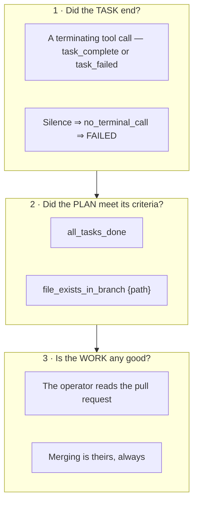
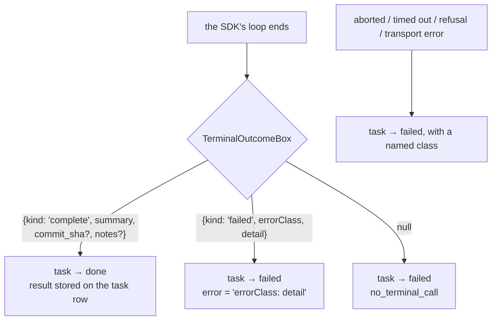
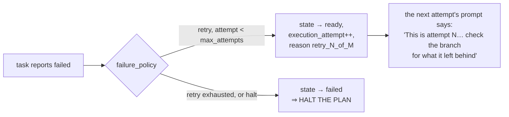

# 7 · Evaluation

> **The honest headline:** Mycelium evaluates *events* thoroughly and *work* barely. Success is
> judged by two declarative criteria and a human merge. There is no LLM-as-judge, no test-result
> parsing, and no quality scoring — and that is a deliberate v1 position, not an oversight.

---

## 7.1 The three things that get evaluated



Everything else — every event, limit, refusal and cost — is *recorded* for the operator, not
*judged* by the system.

---

## 7.2 Task-level: the model must say so

A task ends **only** because the model called `task_complete` or `task_failed`. The outcome is
the structured content of that call.



> **Silence must not be indistinguishable from success.** A model that simply stops producing
> tool calls has told you nothing, and treating that as completion is the failure mode most
> likely to ship broken work quietly.

The failure classes the system itself produces are deliberately machine-readable:

| Class | Meaning |
| --- | --- |
| `no_terminal_call` | the run ended without either terminating tool |
| `limit_exceeded` | passed the wall clock |
| `aborted: <reason>` | teardown, cancel, TTL |
| `refusal: … (<category>)` | the model declined; **surfaced, never silently retried on a fallback model** |
| `transport_error: <message>` | the SDK loop threw |
| `<error_class>: <detail>` | the model's own honest failure |

The prompt makes the norm explicit: *"Failing honestly is better than reporting a success you
cannot support."* And: *"Do not retry a failed task yourself. Report the failure; the
orchestrator decides."* **The agent evaluates nothing about whether to continue** — that is the
failure policy's job.

### The failure policy is the only retry mechanism



A retry resumes from the spend the dispatch carries (`cost_spent_so_far_microusd`), because
`limits.cost_microusd` is **task-wide across execution attempts**.

The plan skill's guidance on choosing: *"`retry` is for genuine flakiness — a network fetch, a
slow service — never for a task that failed because it was wrong. A wrong task retried three
times is a wrong task three times."*

---

## 7.3 Plan-level: two declarative criteria

Evaluated by the **orchestrator**, deterministically, against durable state only.

```ts
type SuccessCriterion =
  | { type: 'all_tasks_done' }
  | { type: 'file_exists_in_branch'; path: string };
```

| Criterion | Passes when |
| --- | --- |
| `all_tasks_done` | there is **at least one** task and every one is `done` (an empty list fails) |
| `file_exists_in_branch` | the repo and branch are both known **and** Gitea reports the path exists on `plan/<id>` |
| *anything else* | **fails** — an unknown type is never a pass |

Evaluation reads durable state; **there is no wait for a final push.** If the agent did not push
it, it did not happen.

> **Criteria have to be checkable.** The plan skill tells operators: *"The orchestrator
> understands exactly two… Anything else must become a file the plan produces — 'a written
> comparison' becomes `findings.md`. 'Works well' is not a criterion."*

This is the design's honest boundary. It buys determinism — the orchestrator *cannot* misjudge —
at the price of expressiveness. A plan that needs richer verification encodes it as a task that
runs the check in the sandbox and fails itself if the check fails.

### A plan carrying a terminal reason can never be `done`

```
passed = allPassed(outcomes) && plan.terminal_reason === null
```

So a plan that was cancelled, hit its TTL, lost its supervisor, blew its budget, or halted on a
task failure is `failed` **even if its criteria happen to pass.**

---

## 7.4 Finalization and the manifest

```mermaid
sequenceDiagram
    participant OR as Orchestrator
    participant GT as Gitea
    participant SU as Supervisor

    Note over OR: every task terminal ⇒ state = finalizing
    OR->>GT: evaluate each success criterion
    OR->>GT: openPullRequest(plan/&lt;id&gt; → main)
    Note right of GT: head SHA == base SHA ⇒ returns null.<br/>Nothing was pushed, so there is<br/>nothing to review.
    OR->>GT: headSha(plan/&lt;id&gt;)
    OR->>OR: write the manifest, set done | failed,<br/>NULL the plan token
    OR->>SU: authorize teardown (sent once, result unchecked)
    OR-->>OR: operator sees the manifest
```

```ts
interface PlanManifest {
  head_sha: string | null;
  pr_url: string | null;
  criteria: Array<{ type: string; path?: string; passed: boolean }>;   // PER-CRITERION
  cost_spent_microusd: number;   // authoritative
  tokens_spent: number;          // the detail figure beside it
  wall_clock_ms: number;
  terminal_reason: string | null;
}
```

**Order matters, and failure is handled by *not* writing.** Criteria are evaluated, the PR is
opened, the manifest is written — and only then is teardown authorised, because pushed commits
are the only thing that survives. If any of that throws, an `error` event is recorded and the
plan **stays in `finalizing` for the next tick to retry**, *rather than writing a manifest that
claims less than actually happened.*

`finalize` is idempotent by construction: it bails unless the plan is still `finalizing`.

---

## 7.5 Human evaluation is the last step, by design

> *"The plan finishes with a manifest carrying branch, head SHA and PR URL — **merging that PR is
> yours, always: the system opens it and stops.**"*

B7's reasoning: pushed work survives teardown, git history joins the event log, and **agents
never touch `main`.** Protected-branch rules on `main` and on other plans' `plan/*` branches are
what contain the bot token.

The dashboard's plan page is built for the *other* human evaluation — the one at the approval
gate. Its assumptions section is headed literally **"Assumptions — are these true?"**, and the
plan skill instructs the reader to put them to the operator **as questions, not as a list to
skim**: *"The gate exists so a wrong assumption is caught here rather than three tasks in."* The
non-goals section's empty state reads *"None declared. Nothing bounds the agent's scope."*

---

## 7.6 Event-level evaluation: the alert rule

The one place the system *does* apply judgement automatically is deciding which recorded events
deserve an operator's attention. See
[08 · Observability §8.4](08-observability.md#84-alerts) for the full rule. Its defining
principle:

> **An alert is something that already happened and will never resurface on its own.**

Which is why a *task's* cost ceiling is not an alert (it shows on the plan) but a *plan's* is (it
stopped everything).

---

## 7.7 Aggregate evaluation: the monitor page

Over a 1 / 7 / 30-day window:

| Panel | Measures |
| --- | --- |
| Throughput | plans by the state they are in **now** (explicitly *not* a funnel), tasks by outcome with cost, `executions` and `dispatches` summed |
| Spend | per-day totals bucketed on `finished_at` (UTC) with a sparkline |
| Latency | task and approval **p50/p95**, via `percentile_disc` so each figure is a duration that actually occurred |
| Failures | the 20 most recent failed/cancelled plans with reason and provision attempts |
| Events | warn+error counts by type — stated as a **superset** of the alert list |

`proposed` is deliberately **not windowed**: *"a plan proposed five weeks ago is still waiting on
you."*

Spend is keyed on `finished_at` because nothing in the schema timestamps spend, and that is *"the
nearest honest key"* — the kind of caveat the code states rather than hides.

---

## 7.8 How the system itself is evaluated

| Layer | Method |
| --- | --- |
| Orchestrator | against a **real PostgreSQL 17** — `FOR UPDATE SKIP LOCKED`, `LISTEN/NOTIFY` and advisory locks all behave differently anywhere else |
| Supervisor & worker | against in-memory fakes behind driver interfaces (B22) |
| Containers, gVisor | opt-in Linux suite (`SUPERVISOR_DOCKER_TESTS=1`) |
| systemd scopes | opt-in Linux suite (`SUPERVISOR_SYSTEMD_TESTS=1`) — proves a kill reaches a **grandchild** |
| git drivers | run only if `git` is on `PATH`; a real repo for behaviour, an injected fake `exec` to inspect the argv and environment handed to git |
| A live model call | opt-in (`WORKER_LIVE_TESTS=1`) — **spends real money** |

**B22's reasoning** for the fakes: the supervisor's bugs live in its admission, lifecycle and
teardown logic, and those are testable without a container runtime — and gVisor does not run on
the operator's Windows machine, so mandating real containers everywhere would produce *a suite
the operator cannot run.*

Two structural tests are worth calling out because they enforce architecture rather than
behaviour:

- **The seam test** walks `packages/worker/src` and fails if any file other than
  `runner/agent-sdk.ts` and `runner/tools.ts` imports the Agent SDK.
- **The recursive schema-closure test** on the custom tools, added after an open nested object
  `400`d the API on the first bring-up — the previous version only checked the top level.

---

## 7.9 The evaluation gap, stated plainly

| Not evaluated | Consequence |
| --- | --- |
| **Whether the code the agent wrote is correct** | The agent runs tests in the sandbox if the task tells it to; nothing parses the results. `all_tasks_done` passes on the agent's own say-so |
| **Whether `task_complete`'s summary is truthful** | It is model output stored verbatim |
| **Output quality, in any form** | No LLM-as-judge, no rubric, no scoring |
| **Whether a criterion was *meaningfully* met** | `file_exists_in_branch` checks existence, not content |
| **Cost-effectiveness of a plan** | Spend is reported; nothing compares it to value delivered |

`future_work/context-management.md` sketches a much richer evaluation regime — measured token
savings reported alongside task quality, retries, latency and operator interventions, with an
offline inline-context baseline. **None of it is implemented**, and that archive is
token-denominated where the code is now cost-denominated. Treat it as history, not as a spec.

The one end-to-end evaluation that matters most **has not been run**: ticket 16 §6.5's real smoke
run against live infrastructure. See [09 · Known Drift](09-known-drift.md).

---

*See also: [08 · Observability](08-observability.md) · [02 · Flow of Use](02-flow-of-use.md)*
