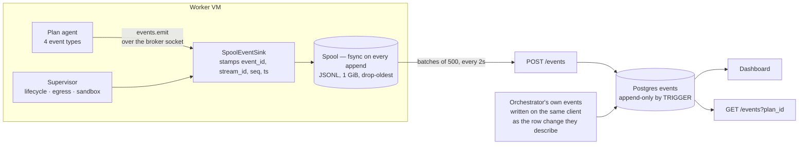
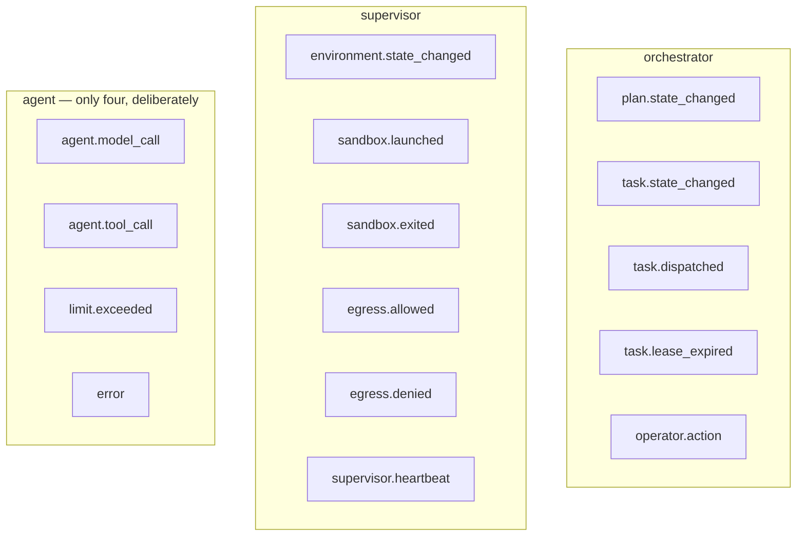
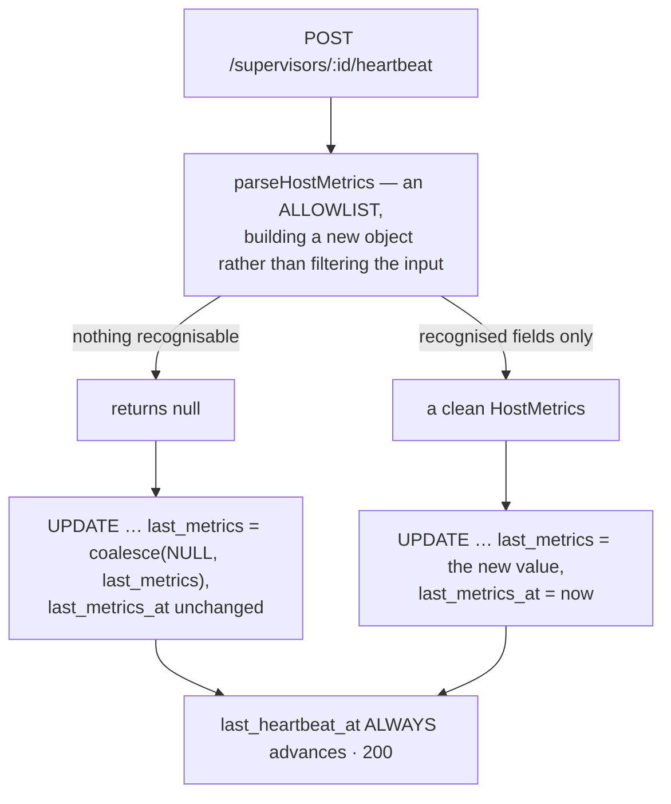
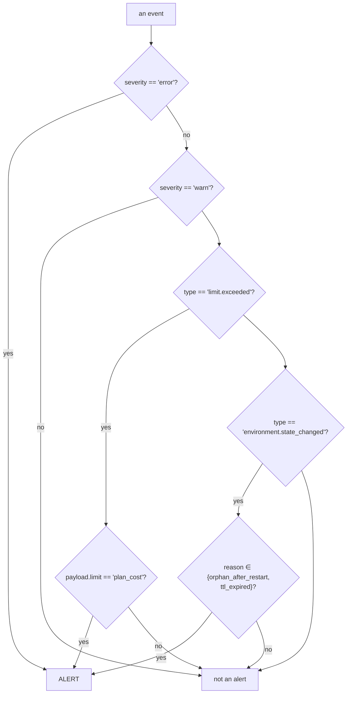
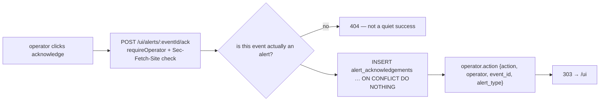

# 8 · Observability

> **Goal G4:** *every tool call, spawn, error and limit event is recorded append-only and
> queryable through the API and dashboard.*

Observability in Mycelium is one append-only event log, one durable transport, and one
server-rendered dashboard. There is no metrics backend, no tracing system, and no log aggregator
— deliberately, at this scale.

---

## 8.1 The event pipeline, end to end



**The agent never posts events to the orchestrator.** It emits to its supervisor, which is the
only path that survives an orchestrator outage — and it is what puts every stream's sequence
counter in exactly one place. The agent's *only* direct write to the orchestrator is the task
status route.

### Why the branches are what they are

| Response | Action | Reasoning |
| --- | --- | --- |
| `2xx` | commit — drop from the spool | |
| `5xx` / `429` / unreachable | keep, retry in 2 s | An orchestrator that is **down** is transient. That is what the spool is for |
| any other `4xx` | set aside in `events.jsonl.rejected` | An orchestrator that **refused** has found an emitter bug. Retrying never fixes it, and it would wedge every later event behind it |

**Durability properties:**

- `handle.sync()` — a real fsync, not an OS buffer. *"The whole point of the spool is surviving a
  crash, which an OS buffer does not."*
- Truncation is rewrite-to-`.tmp` then `rename()`, so a crash mid-truncate leaves the original
  intact.
- Overflow is **drop-oldest** — losing the newest would hide whatever is currently going wrong —
  and a drop is itself an event: `{code: 'events_dropped', dropped_from_seq, dropped_to_seq,
  dropped_count}`, so a sequence gap reads as a full disk rather than as lost events.
- Delivery is **bounded at-least-once, ordered per stream**. A crash between POST and commit
  replays, and the orchestrator dedupes on `event_id`.

### Sequence numbers refuse to guess

Startup inverts the durability problem: the spool has already dropped whatever the orchestrator
acknowledged, so **neither side alone knows how far a stream got.** Recovery takes the higher of
the spool's own marks and the orchestrator's high-water marks — and until that has happened,
`next()` **throws**:

> *"refusing to assign a sequence number before reconciliation: a truncated spool cannot prove
> how far this stream got"*

*A supervisor that guessed would be reporting an emitter bug it had caused itself.*

### Two idempotency keys, two different meanings

| Key | Situation | Response |
| --- | --- | --- |
| `event_id` (UUIDv7, minted by the emitter) | benign replay after a crash | silently dropped |
| `(stream_id, seq)` UNIQUE | **a reused sequence number** | **409 `seq_reused`** — an emitter bug, rejected as one |

---

## 8.2 What is actually tracked

The envelope is shared by all three tiers and is closed (`additionalProperties: false`):

```
event_id · ts · source · stream_id · seq · type
   [+ severity, project_id, plan_id, task_id, payload]
```

`ts` is the emitter's wall clock; **ordering comes from `seq`, not from `ts`.** `payload` stays
untyped in v1 deliberately — typing it can wait until the dashboard says which shapes it needs.

### The 15 event types



`limit.exceeded` and `error` are emitted by more than one tier. **`task.state_changed` is absent
from the agent's set on purpose** — the orchestrator records task transitions itself inside
`reportTaskStatus`, and a second copy from the agent would double-count the timeline.

### Agent payloads in detail

| Type | Payload |
| --- | --- |
| `agent.model_call` | `model`, `stop_reason`, **`tokens_total`** (task-wide cumulative), `tokens_this_attempt`, `cost_total_microusd`, `cost_this_attempt_microusd`, `input_tokens`, `output_tokens`, `cache_read_tokens`, `cache_write_tokens`, `usage_source: 'provider'` |
| `agent.model_call` (compaction) | `phase: 'compaction'`, `trigger: manual\|auto`, `pre_tokens`, `post_tokens` |
| `agent.tool_call` (result) | `tool`, `outcome: 'result'`, `is_error`, and `subagent_id`/`subagent_type` when it came from a subagent |
| `agent.tool_call` (containment) | `tool`, `outcome: 'containment_denied'`, `is_error: true`, `reason` |
| `agent.tool_call` (git) | `tool: 'git'`, `action`, `commit_sha` or `branch` |
| `agent.tool_call` (subagents) | `phase: subagent_roster \| subagent_start \| subagent_stop` (+ `duration_ms`, `last_message` ≤ 500 chars) |
| `limit.exceeded` | `{limit: 'wall_clock_min', allowed}` · `{limit: 'commit_cadence', allowed, calls_since_commit, enforced: false}` · `{limit: 'task_cost'}` · `{limit: 'max_turns'}` |
| `error` | `{stage: 'aborted', reason}` · `{stage: 'model_call', message}` · `{stage: 'status_report', state, attempts, message}` |

> **`tokens_total` is task-wide cumulative, never a delta.** A dropped event on a bounded spool
> must not lose spend, and a retry must not reset the running total.

**Everything rides an existing type under a `phase` key**, because the schema enum is closed. The
precedent was set by compaction riding `agent.model_call`; the four subagent events reuse it on
`agent.tool_call` — defensible because *a subagent is an invocation of the SDK's `Agent` tool*.

### Orchestrator payloads

| Type | Severity | Payload |
| --- | --- | --- |
| `plan.state_changed` / `task.state_changed` | **`warn` iff `to === 'failed'`**, else `info` | `{from, to, reason}` |
| `task.dispatched` | info | `{dispatch_id, attempt}` |
| `task.lease_expired` | warn | `{reason: 'lease_expired'}` |
| `limit.exceeded` | warn | `{limit: 'plan_cost', allowed, spent_on_other_tasks, next_task_ceiling}` or `{limit: 'wall_clock_min', value}` |
| `supervisor.heartbeat` | **`debug`** | `{agent_id}` — **and nothing else** |
| `operator.action` | info | `{action, operator}` |
| `error` | error | `{stage, message}` — stages: `ensure_repo`, `revoke_bot_token`, `authorize_teardown`, `plan_dispatch_prepare`, `plan_dispatch`, `finalize` |

**Every orchestrator event is written on the same database client as the row change it
describes**, so a state change and its event commit together or not at all.

### The `reason` vocabulary is the timeline

Plan: `proposed`, `approved`, `rejected`, `cancelled`, `selecting_supervisor`,
`supervisor_accepted`, `no_healthy_supervisor`, `dispatch_prepare_failed`,
`all_candidates_rejected`, `validation_failed`, `ttl_expired`, `supervisor_lost`,
`all_tasks_terminal`, `halt`, `criteria_passed`, `criteria_failed`.

Task: `dependencies_satisfied`, `claimed`, `acknowledged`, `reported`, `lease_expired`,
`dispatch_failed:<reason>`, `retry_N_of_M`, `plan_halted`, `plan_cancelled`,
`wall_clock_exceeded`.

Reading a plan's event stream in `reason` order tells you what happened without opening any code.

---

## 8.3 Host metrics

Reported on every heartbeat (30 s), stored as **current value only** on the `agents` row.

| Group | Fields |
| --- | --- |
| CPU | `cpu_count`, `load_1/5/15`, `cpu_saturation` = `load_1 / cpu_count` |
| Memory | `mem_total_mb`, `mem_available_mb`, `mem_used_pct` |
| Disk | `disk_total_mb`, `disk_free_mb`, `disk_used_pct` — nullable **together** |
| Ledger | `environments`, `environment_capacity`, `sandboxes` |
| Meta | `uptime_sec`, `version` |

**No history table.** It would be ~2,880 rows per VM per day into a database with no retention
policy, answering a question nothing asks yet.

### The guarantee: telemetry can never cost a VM its dispatch eligibility



The body is **deliberately unvalidated at the route**: a bad report must degrade to "no report",
never to a 400 that costs a working VM its place in the rotation. `{}`, `null`, a bare string,
unknown keys, `Number.MAX_VALUE`, a string where a number belongs — all return 200.

Three details:

- **An allowlist, built forward, not a filter.** An unnamed key cannot reach the jsonb column the
  dashboard renders. `{cpu_count: 2, hostname: 'worker-1', token: 'sk-live-nope'}` stores exactly
  `{cpu_count: 2}`.
- **Percentages are clamped, not dropped** — *a reading of 101% is wrong, but not a lie.*
- **Numeric strings are rejected.** A supervisor sending `"7"` has a bug worth seeing as missing
  data.
- **`last_metrics_at` moves separately from `last_heartbeat_at`.** A silent heartbeat leaves the
  last real report *and its age* alone — so **alive-but-silent is visible rather than looking like
  fresh data.**

The heartbeat *event* carries only `{agent_id}` at `debug` severity, because it fires every 30 s
per VM into a table with no retention policy. The metrics live on the row, where there is one,
instead of 2,880 copies a day.

---

## 8.4 Alerts

> **An alert is something that already happened and will never resurface on its own.** That is
> what distinguishes it from the needs-attention queue, which is about things still waiting.

**There is no alerts table.** An alert is a *view* of an event — so "an alert is never the only
record" is true by construction, and changing which events qualify is a code change rather than a
backfill.



**Why a task's own cost ceiling is not an alert but a plan's is:** a task ceiling is the failure
policy's business and already shows on the plan page; a *plan* ceiling stopped everything.
Likewise `wall_clock_min`, `task.lease_expired`, and `warn`-severity state changes are the plan's
own business and resurface there.

The query prefilters on what the partial index covers, then the pure rule decides the rest. **It
is the only cross-plan read of `events` in the system.**

### Acknowledgement



**The event itself is never mutated** — the append-only trigger would refuse. `listAlerts` LEFT
JOINs and filters `a.event_id IS NULL`, so the acknowledgement row is what removes it from the
list. Acknowledging a non-alert is a 404 rather than a quiet success.

---

## 8.5 The dashboard as an observability surface

| Page | The question it answers |
| --- | --- |
| **Overview** | *What needs me? What broke and is unacknowledged? **Why is each plan not running?** Are the VMs alive?* |
| **Plan** | *Is this assumption true? What did each task cost and how many attempts did it take? Which subagents ran? What does the manifest say?* |
| **Servers** | *Is this VM healthy — and is its telemetry fresh, or just its heartbeat?* |
| **Monitor** | *Over 1/7/30 days: throughput, spend per day, p50/p95 latency, recent failures, warn+error counts by type* |

Three honesty rules are wired into the rendering:

1. **`whyNotRunning()`** is a first-class column, not a tooltip: *awaiting approval*, *waiting for
   a supervisor*, *N provision attempts, retry at …*, *selecting a supervisor*, or the terminal
   reason.
2. **Server counts are labelled `(reported)`** — the orchestrator has no environments table, so
   everything under that heading is the supervisor's in-memory ledger talking about itself.
   Metrics age is shown *beside* heartbeat age so alive-but-silent cannot pass for fresh. A VM
   predating migration `0003` reads *"No telemetry… It is still heartbeating"* rather than zeros.
3. **Spend bars are drawn relative to the biggest day in the window, not to a budget** — there is
   no budget column, and drawing against an invented ceiling would be a fiction.

Also deliberate: `formatCost` renders **`<$0.01`** rather than `$0.00` for a non-zero amount,
because *a task that cost something must never render as free*; and the monitor's event counts
are stated as a **superset** of the alert list, because `isAlert` filters on payload, which a
`GROUP BY` cannot express.

### Live updates

Polling every 5 s with an FNV-1a version per region. A region whose version is unchanged is
**skipped entirely — an idle system mutates no DOM at all.** A region containing the focused
element is left alone. `401`/`403`/`404` stop the poll permanently, because none of those recover
on their own; two consecutive failures mark the page stale (*one miss is a blip*); a hidden tab
stops its timer, because a throttled poll would report a time it did not really check at.

---

## 8.6 Querying it directly

```sh
node ~/.claude/skills/plan/mycelium.mjs events <plan-id>
node ~/.claude/skills/plan/mycelium.mjs status <plan-id>   # per-task state + spend in dollars
```

`GET /events?plan_id=…&after=…&limit=…` pages with a `(received_at, event_id)` row comparison, so
ties are never skipped. `plan_id` is required — the only cross-plan read is the alert query.

Indexes shape what is cheap: `events(plan_id, received_at, event_id)` matches the query ordering
exactly; a partial `events(received_at DESC, event_id) WHERE severity IN ('warn','error')` serves
alerts; `events(ingested_by, stream_id)` serves high-water marks. **There is no index on
`events(type)`**, which is why the monitor page has no full event-type histogram.

---

## 8.7 What is *not* observable

| Gap | Why |
| --- | --- |
| **Per-subagent cost** | The SDK's `modelUsage` breaks spend down by model, never by subagent. An apportioned number on the page an operator uses to judge a budget is worse than no number |
| **Real per-turn dollar cost** | The SDK's per-call `usage` carries no cost; only `modelUsage` on the terminal `result` does. Per-turn `cost_*_microusd` fields **mirror token totals** |
| **Cost on an aborted or timed-out task** | `modelUsage` never arrived, so the reported cost is a token count |
| **Metrics history** | Current value only, by design |
| **Event retention** | **No policy at all.** A heartbeat row per VM every 30 s accumulates forever |
| **A full event-type histogram** | No index on `events(type)` |
| **The model key's real spend** | It lives in a provider console nothing here can read |
| **`infra/` correctness** | Nothing in it is covered by CI; `verify.sh` proves the parts, not the whole |

---

*See also: [07 · Evaluation](07-evaluation.md) · [Orchestrator](layers/orchestrator.md) · [Supervisor](layers/supervisor.md)*
