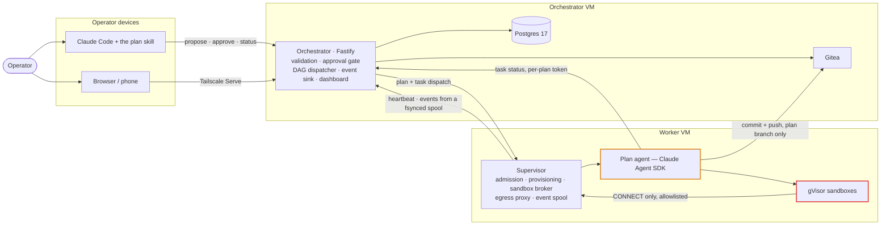

# Mycelium — Documentation

> An architecture and reference set describing **the system as it currently is**, written from
> the code rather than from the design record. Where the two disagree, the disagreement is
> recorded in [09 · Known Drift](09-known-drift.md) rather than smoothed over.

**Mycelium is a single-operator system for agentic software development, scraping and research.**
You plan conversationally in Claude Code, approve the plan, and it executes on a remote VM: an
LLM agent works through a task DAG, runs code in a gVisor sandbox, and commits to a branch.
Nothing is exposed to the public internet — the tailnet is the perimeter.

---

## Start here

| | Document | What it answers |
| --- | --- | --- |
| **01** | [System Overview](01-system-overview.md) | The four tiers, the trust model, the stack, the decisions that shape everything else, and what is deliberately out of scope |
| **02** | [Flow of Use](02-flow-of-use.md) | A plan from conversation to merged PR — what each component does at each step, and what happens when it goes wrong |

## The agent

| | Document | What it answers |
| --- | --- | --- |
| **03** | [The Agentic Harness](03-agentic-harness.md) | How the Claude Agent SDK is embedded, the exact `query()` configuration, the three-way termination race, and what the host keeps for itself |
| **04** | [Context & Memory](04-context-and-memory.md) | What goes into a task's context, what is deliberately left out, how compaction is observed — and why there is **no agent memory at all** |
| **05** | [Custom Tools](05-custom-tools.md) | All ten tools, their schemas, and the mutable-box mechanism that lets a tool end a task |

## The system's guarantees

| | Document | What it answers |
| --- | --- | --- |
| **06** | [Guardrails](06-guardrails.md) | Eight guardrails, each placed where it cannot be talked around by the thing it checks — and what is deliberately *not* guarded |
| **07** | [Evaluation](07-evaluation.md) | How a task ends, how a plan is judged, what the manifest records — and the honest gap where quality assessment would go |
| **08** | [Observability](08-observability.md) | The event pipeline, all 15 event types with payloads, host metrics, the alert rule, and the dashboard |
| **09** | [Known Drift](09-known-drift.md) | Where the code and the written record currently disagree |

## Per-layer reference

| Layer | Package | Reference |
| --- | --- | --- |
| Planning client | `~/.claude/skills/plan/` *(outside this repo)* | [planning-client.md](layers/planning-client.md) |
| Contracts | `packages/contracts` | [contracts.md](layers/contracts.md) |
| Control plane | `packages/orchestrator` | [orchestrator.md](layers/orchestrator.md) |
| Host daemon | `packages/supervisor` | [supervisor.md](layers/supervisor.md) |
| Plan agent | `packages/worker` | [03 · The Agentic Harness](03-agentic-harness.md) |
| Runtime | `infra/` | [infrastructure.md](layers/infrastructure.md) |

---

## The system in one diagram

---

## Five things that explain most of the design

1. **Approval is a database column, not a prompt convention.** The dispatcher filters on
   `approved_at IS NOT NULL`. Nothing an agent says can bypass a column.
2. **The agent is assumed compromised.** It holds real credentials while reading untrusted
   content, so *nothing inside it is a containment boundary* — containment is the egress proxy,
   the sandbox, branch protection, and a `PreToolUse` deny hook.
3. **Silence is never success.** A task ends only because the model called a terminating tool. A
   run that simply stops is a failure.
4. **Pushed commits are the only thing that survives.** There is no rescue push on teardown; the
   commit cadence is the cure for lost work.
5. **Rejection is the correctness mechanism, not selection.** The supervisor owns capacity truth,
   so a poor placement self-corrects — which is why first-fit is enough.

---

## Status

> **The system has never run a plan end to end.** Four packages, ~1,131 passing tests, the plan
> skill and the dashboard are all built — but every test runs against a fake, a local Postgres, or
> a temporary git repository. One real orchestrator + worker bring-up has happened and found
> fifteen distinct problems, all recorded and fixed. The actual end-to-end smoke run remains the
> outstanding acceptance gate.

See [09 · Known Drift §9.4](09-known-drift.md#94-unverified-rather-than-wrong).

---

## Conventions in this set

- **Diagrams are Mermaid**, rendered inline by GitHub and most editors.
- **Quotations in italics come from the code's own comments or the design record**, because in
  this codebase the reasoning is usually written next to the thing it explains.
- **Decision references** (`B1`–`B22`, `G1`–`G6`, `D28`/`D30`) point into `mycelium-baseline.md`
  and `future_work/mycelium-spec.md`, which are kept outside the repository. They are cited by
  name, not linked.
- This set describes the current code. It does **not** replace the baseline (the design record),
  the tickets (the build steps), or `future_work/` (the archive).
