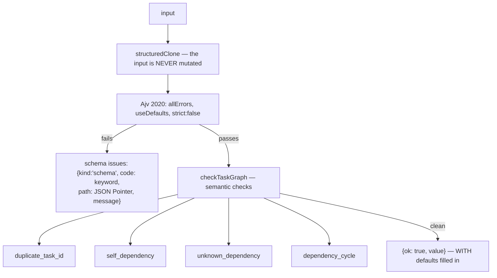
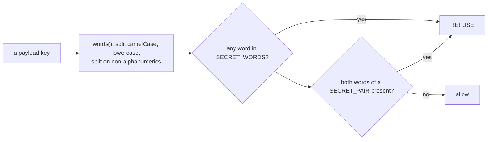

# Layer · Contracts

> **Package:** `packages/contracts` · **Stack:** Ajv 2020 + ajv-formats, JSON Schema draft 2020-12
> **Role:** the only code shared by all three services

Two schemas, their validators, one secret-key predicate, and generated TypeScript types. That is
the entire package — and it is deliberately small, because **it is the one place where a drift
between two services becomes a bug nobody can see.**

---

## 1 · The plan schema

`plan.schema.json` is **the single source of truth**. The skill authors against it by submitting;
the orchestrator re-validates at submission. *The plan is never validated anywhere else, which is
what stops a second copy of the schema existing.*

Every object is **`additionalProperties: false`**, top level included.

### Top level

| Property | Type | Constraints | Default | Required |
| --- | --- | --- | --- | --- |
| `goal` | string | 1 … 2000 chars | — | ✔ |
| `project` | `projectRef` | see below | — | ✔ |
| `assumptions` | string[] | **1** … 50 items, each 1 … 1000 | — | ✔ |
| `non_goals` | string[] | 0 … 50 items | `[]` | |
| `env` | enum | `dev` \| `prod` | — | ✔ |
| `tasks` | `task[]` | 1 … 50 | — | ✔ |
| `success_criteria` | `successCriterion[]` | 1 … 20 | — | ✔ |
| `egress` | `egressHost[]` | ≤ 50, **`uniqueItems`** | `[]` | |
| `max_cost_microusd` | integer | **≥ 1, no maximum** | **none** | ✔ |
| `env_ttl_min` | integer | 1 … 1440 | `240` | |

> **`max_cost_microusd` is required and has no default.** A token ceiling could be defaulted to
> the sum of the task ceilings, because those summed meaningfully with no price table. A cost
> ceiling cannot be inferred the same way — **requiring the field is what replaced the default.**

> **`max_concurrent_agents` no longer exists.** It was removed when subagent concurrency became
> supervisor-derived: the operator has no visibility into the VM's memory, only the supervisor
> does. A plan still carrying the field is **rejected** by `additionalProperties`.

### `$defs`

**`projectRef`** — a `oneOf`, so `{id, name}` together is rejected:

| Variant | Shape |
| --- | --- |
| existing | `{ id: uuid }` |
| new | `{ name: string }`, pattern `^[a-z0-9][a-z0-9-]{1,62}$` — *"also the Gitea repository name, so it is slug-shaped"* |

**`task`** — required `id`, `description`, `limits`:

| Field | Constraint |
| --- | --- |
| `id` | `^[a-z0-9][a-z0-9-]{0,62}$` — plan-local, **distinct from the database UUID assigned at submission** |
| `description` | 1 … 8000 chars — *"v1 carries no typed context capsule; large inputs live in the repo"* |
| `depends_on` | `taskId[]`, ≤ 50, unique, default `[]` |
| `limits` | required |
| `failure_policy` | default **`{type: 'halt'}`** |

**`limits`** — both required:

| Field | Range |
| --- | --- |
| `cost_microusd` | 1 … **5 000 000** ($5.00) — *"the maximum is a sizing convenience derived from published Opus 5 rates for a roughly 500k-token task"* |
| `wall_clock_min` | 1 … **120** |

**`failurePolicy`** — `oneOf`: `{type: 'retry', max_attempts: 1…5}` or `{type: 'halt'}`.

**`successCriterion`** — `oneOf`: `{type: 'all_tasks_done'}` or
`{type: 'file_exists_in_branch', path}` where `path` matches `^(?!/)(?!.*\.\.).+$` — *"repo-relative
path in `plan/<id>`. No leading slash, no parent traversal."*

**`egressHost`** — ≤ 253 chars:

```
^(\*\.)?([a-z0-9]([a-z0-9-]{0,61}[a-z0-9])?\.)+[a-z]{2,63}$
```

*"No scheme, port, or path: the proxy matches on the CONNECT host and allows 80/443 only."*

| Accepted | Rejected |
| --- | --- |
| `example.com`, `api.github.com`, `my-site.co.uk`, `*.example.com`, `*.cdn.example.com` | `https://example.com`, `example.com/data`, `example.com:8443`, **`*`**, `foo.*.example.com`, `localhost` (single label), `10.0.0.1`, `.example.com`, `example.com.`, `-bad.example.com`, `Example.com` (uppercase), `''`, `'example.com '` |

Duplicates are rejected by `uniqueItems`; a non-array `egress` is rejected outright.

---

## 2 · The event schema

`event.schema.json` — `EventEnvelope`, shared by all three tiers, `additionalProperties: false`.

| Field | Type | Notes |
| --- | --- | --- |
| `event_id` | uuid | **UUIDv7, minted by the emitter. The idempotency key** |
| `ts` | date-time | The emitter's UTC wall clock — *"ordering comes from `seq`, not this"* |
| `source` | enum | `orchestrator` \| `supervisor` \| `agent` |
| `stream_id` | string, 1 … 128 | `seq` is monotonic **within one stream** |
| `seq` | integer ≥ 0 | *"Gaps mean lost events; duplicates are dropped on `event_id`"* |
| `type` | enum | **15 closed values** (below) |
| `severity` | enum | `debug` \| `info` \| `warn` \| `error`, default `info` |
| `project_id` / `plan_id` / `task_id` | uuid \| null | default `null` |
| `payload` | object | default `{}` — **deliberately untyped in v1** |

The 15 types: `plan.state_changed`, `task.state_changed`, `task.dispatched`, `task.lease_expired`,
`agent.model_call`, `agent.tool_call`, `sandbox.launched`, `sandbox.exited`, `limit.exceeded`,
`supervisor.heartbeat`, `operator.action`, `egress.allowed`, `egress.denied`,
`environment.state_changed`, `error`.

> **Because the enum is closed, new observability rides an existing type under a `phase` key** —
> compaction on `agent.model_call`, the four subagent events on `agent.tool_call`. See
> [08 · Observability](../08-observability.md).

---

## 3 · Validation



**Schema failure short-circuits the semantic checks** — *"semantic checks run only once the shape
is trusted."*

`useDefaults` means the returned value carries schema defaults, and **that is the document the
orchestrator persists**, so `plans.spec` is always complete rather than as-submitted.

Cycle detection is an iterative DFS with a white/grey/black colour map, returning **one actual
cycle as a closed id path** (`Dependency cycle: a -> b -> a.`) rather than merely reporting that
one exists. Duplicate ids keep the first definition; unknown dependencies are skipped in the walk
because they are reported separately.

Every issue carries a JSON Pointer path, which is what lets the plan skill be told: *"Fix exactly
what they name. **Do not guess at a rule the issues did not state.**"*

---

## 4 · The secret-key predicate

One export, `looksLikeSecretKey(key)`, used as a backstop at **two** boundaries — the supervisor's
`events.emit` handler and the orchestrator's ingest route. It lives here precisely so the two
cannot disagree: *a key one accepts and the other refuses would wedge the spool permanently.*



**Standalone words (14):** `token`, `secret`, `secrets`, `password`, `passwd`, `pwd`,
`credential`, `credentials`, `auth`, `authorization`, `bearer`, `apikey`, `jwt`, `signature`.

**Pairs — both words must appear (10):** `api`+`key`, `private`+`key`, `access`+`key`,
`signing`+`key`, `encryption`+`key`, `access`+`tokens`, `refresh`+`tokens`, `bearer`+`tokens`,
`id`+`tokens`, `session`+`tokens`.

Because camel-case is split first, `botToken`, `BOT_TOKEN`, `bot-token` and `bot.token` all reduce
identically, and `APIKey` becomes `api`+`key`.

### The carve-out that matters

> **Singular `token` is a credential. Plural `tokens` is a count.**
>
> The previous rule was an unanchored substring match, `/token|secret|password|api[_-]?key/i`. It
> refused `tokens_total`, `tokens_this_attempt`, `input_tokens`, `output_tokens` and
> `cache_read_tokens` — **five of the eight keys in `agent.model_call`.** The result: no per-turn
> model telemetry was ever recorded, silently.
>
> The migration manifest lists this carve-out under **"do not touch."**

The test suite pins it from both directions: 30 credential-shaped keys refused; the eight
`agent.model_call` keys, 36 other real payload keys, and the five cost keys all allowed;
`token` → true, `tokens` → false, `access_tokens` → true.

---

## 5 · Types and exports

```ts
interface ValidationIssue { kind: 'schema' | 'semantic'; code: string; path: string; message: string }
type ValidationResult<T> = { ok: true; value: T } | { ok: false; issues: ValidationIssue[] }
```

The package exports exactly: `validatePlan`, `validateEvent`, `checkTaskGraph`,
`looksLikeSecretKey`, the `Plan` and `EventEnvelope` types, and the two raw schemas (via JSON
import attributes).

### Generated types

`json-schema-to-typescript` compiles both schemas into `src/generated/`. Two choices worth noting:

- **The output is committed**, so consumers need no build step.
- **`ignoreMinAndMaxItems: true`** — bounds stay in the schema and are enforced by Ajv, rather
  than becoming unwieldy tuple types.

Regenerate with `pnpm --filter @mycelium/contracts generate`.

---

## 6 · What the schema deliberately does not have

The plan skill lists these so an author does not reach for them — *"they have no field, and
inventing one produces a plan the orchestrator rejects"*:

cost budgets in dollars · spawn reserves · context capsules or typed references ·
`required_connections` for external APIs or MCP servers · model profiles · per-task `env` tiers ·
review-gate pause points · scheduled or recurring runs · agent-spawned subtasks.

**A v1 task is a plain-text description; a v1 DAG is fixed at approval.**

---

*See also: [06 · Guardrails](../06-guardrails.md) · [Orchestrator](orchestrator.md) · [Planning client](planning-client.md)*
