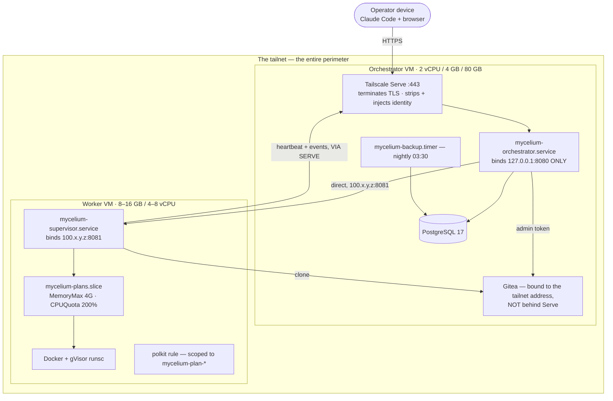
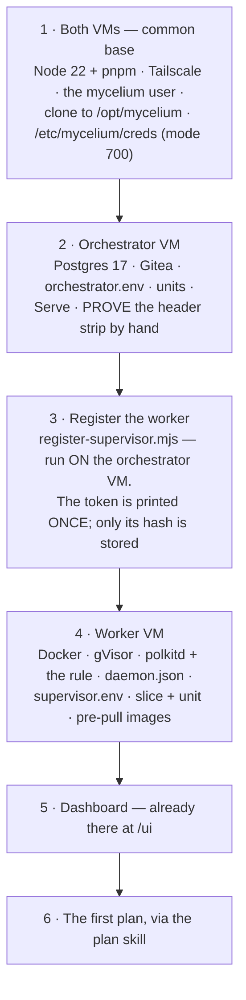
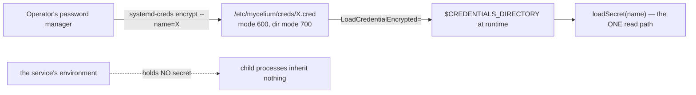

# Layer · Infrastructure

> **Directory:** `infra/` · **Target:** two Debian 13 (trixie) VMs on a tailnet
> **Status:** written, self-checked, and partially proven by one real bring-up

Debian 13 is the target because **gVisor and Tailscale both ship Debian packages, and systemd
encrypted credentials need systemd ≥ 250.**

---

## 1 · Topology



### The ingress invariant, and its one asymmetry

**Tailscale Serve is the only ingress to the orchestrator — for supervisors as well as for the
operator.** The orchestrator binds loopback only; Serve terminates TLS on the tailnet, strips any
client-supplied `Tailscale-User-*` header, and injects its own. `requireOperator` trusts that
header **only because the listener is otherwise unreachable**, and refuses non-loopback
connections outright.

The reverse direction is different: **orchestrator → supervisor is direct** to `100.x.y.z:8081`,
authenticated by peer address (B19). Which is why the supervisor's `HOST` must be a specific
address, and why `loadConfig()` refuses a wildcard bind.

> **Serve is a single point of failure for machine traffic, including heartbeats.** If it goes
> down, VMs are marked unhealthy after 2 minutes and their plans fail on the supervisor-lost
> timeout 5 minutes later. This is a known, accepted gap.

---

## 2 · Bring-up order



**There is no self-registration.** A supervisor is a row an operator inserts.

### The install rule that is not optional

> **Never add `--prod` or `--omit=optional`.** The Agent SDK ships its `claude` binary as a
> platform optional dependency (`@anthropic-ai/claude-agent-sdk-linux-x64`, …). `npm
> --omit=optional` drops it and `query()` throws synchronously. Plain
> `pnpm install --frozen-lockfile` is already safe (spike question Q1).

### The manual proof you must not skip

From another tailnet device:

```sh
curl -H 'Tailscale-User-Login: someone@else.com' https://<host>/plans
```

**A 403 naming *your* login is good.** A 200, or a 403 naming the injected value, means Serve is
not stripping the header — **stop.** `verify.sh` prints this as a permanent **SKIP**, never a
pass, because it is a property of the installed Tailscale that only a second device can prove.

---

## 3 · Secrets — systemd encrypted credentials (B13)



| VM | Credential | Used for |
| --- | --- | --- |
| Orchestrator | `gitea_admin_token` | repos, branches, bot users, PRs |
| Orchestrator | `postgres_password` | folded into `DATABASE_URL` at load |
| Worker | `model_api_key` | injected into each plan agent — **set a provider-side spend limit** |
| Worker | `supervisor_token` | this VM's bearer token to the orchestrator |

Two per-plan secrets are minted at approval and never at rest: the Gitea bot token and the
orchestrator API token. Postgres holds only hashes.

**Why not SOPS/age or a secret manager:** five long-lived values do not justify one, and SOPS/age
protects *distribution* rather than a running host — its key must sit on the VM anyway. systemd
credentials need no third-party tooling and, crucially, **keep secrets out of the process
environment and out of child processes** — which is exactly the supervisor-to-plan-agent boundary
that matters.

Manual decryption requires an explicit `--name=`, because the `.cred` filename does not match the
credential name.

---

## 4 · The unit files

### `mycelium-orchestrator.service`

```
Requires=postgresql.service          # not Wants: migrations run at startup, so an early
After=network-online.target postgresql.service tailscaled.service
                                     # start is a crash loop rather than a wait
LoadCredentialEncrypted=gitea_admin_token:…
LoadCredentialEncrypted=postgres_password:…
Restart=always  RestartSec=5s
```

Hardening: `NoNewPrivileges`, `PrivateTmp`, `PrivateDevices`, `ProtectSystem=strict`,
`ProtectHome`, `ProtectKernelTunables`, `ProtectKernelModules`, `ProtectControlGroups`,
`RestrictAddressFamilies=AF_INET AF_INET6 AF_UNIX`, `RestrictNamespaces`, `LockPersonality`,
`SystemCallArchitectures=native`, and **`MemoryDenyWriteExecute=false`** — the one relaxation,
required by the JIT.

### `mycelium-supervisor.service`

```
Requires=docker.service
SupplementaryGroups=docker
TimeoutStopSec=30s                   # comfortably above the 5s plan-teardown grace (B15),
                                     # so systemd never kills the supervisor MID-TEARDOWN
                                     # and leaves orphans for reconciliation to find
StateDirectory=mycelium
StateDirectoryMode=0700
Slice=system.slice                   # deliberately NOT under mycelium-plans.slice —
                                     # it must not share the budget that slice divides
LoadCredentialEncrypted=model_api_key:… , supervisor_token:…
```

It adds `AF_NETLINK` to the allowed address families and drops `PrivateDevices`,
`ProtectControlGroups` and `RestrictNamespaces`, because it drives Docker and cgroups.

### `mycelium-plans.slice`

```
MemoryMax=4G   MemoryHigh=3G   CPUQuota=200%   TasksMax=2048
```

Every plan agent runs as
`systemd-run --scope --slice=mycelium-plans --unit=mycelium-plan-<id>`.

> **That deterministic scope name is the only handle a *restarted* supervisor has on an agent it
> did not start.** Without the slice, `signalScope` is a no-op and an orphan survives until
> reboot. It is also the sole enforcement of B15's five seconds, because the Agent SDK's own
> teardown timers are `.unref()`'d and can orphan the `claude` subprocess.

### `49-mycelium-plans.rules` — polkit

Grants `org.freedesktop.systemd1.manage-units` to user `mycelium`, **only for units whose name
starts `mycelium-plan-`**.

> **polkit is not on the Debian base image.** Without it, every agent spawn fails
> `Failed to start transient scope unit: Access denied`, the supervisor then rejects every task
> dispatch with `409 agent_not_accepting`, and **the plan retries forever with zero tokens
> spent.** Found on the first bring-up.

### `daemon.json`

```json
{ "runtimes": { "runsc": { "path": "/usr/bin/runsc" } },
  "default-runtime": "runc", "live-restore": true,
  "log-driver": "json-file", "log-opts": { "max-size": "10m", "max-file": "3" } }
```

**Deliberately comment-free.** Docker's parser rejects any unknown key — a `_comment` field made
`dockerd` fail to start on the first bring-up. (`serve.json` gets away with one only because
Tailscale ignores unknown fields.)

Copy it **after** gVisor is installed: a runtime pointing at a missing binary is a fatal config
error. Validate with `dockerd --validate --config-file`.

### `serve.json` — a reference shape, not applied

`tailscale serve set --config` was experimental and has been removed. Serve is now configured
imperatively:

```sh
sudo tailscale serve --bg --https=443 http://127.0.0.1:8080
```

The file is kept for its shape, notably `AllowFunnel: {}` — **Funnel is never enabled**, because
Funnel traffic is public and carries no identity headers, so it would arrive at the loopback
listener as an unauthenticated Serve request.

---

## 5 · Worker configuration

`/etc/mycelium/supervisor.env` (root, 0600):

```
SUPERVISOR_ID=…
ORCHESTRATOR_URL=https://<serve-hostname>
ORCHESTRATOR_PEERS=100.a.b.c
HOST=100.x.y.z                    # a specific address — a wildcard is refused at startup
PORT=8081
STATE_DIR=/var/lib/mycelium
MAX_ENVIRONMENTS=2
SANDBOX_IMAGES=node:22-alpine,python:3.12-alpine
STANDING_EGRESS=registry.npmjs.org,pypi.org,files.pythonhosted.org,api.anthropic.com,100.a.b.c
AGENT_COMMAND=/usr/bin/node /opt/mycelium/packages/worker/dist/src/index.js
AGENT_SLICE=mycelium-plans
#AGENT_MEMORY_MAX_BYTES=2147483648
```

> **`STANDING_EGRESS` must name the model API host and the Gitea host.** It is deny-by-default;
> without `api.anthropic.com` the agent starts fine and then every model call fails. Found on the
> first bring-up.
>
> **`AGENT_SLICE` is not optional** — see the slice note above.
>
> **`AGENT_MEMORY_MAX_BYTES` feeds two things:** the scope's `MemoryMax` and the
> `MAX_CONCURRENT_SUBAGENTS` the SDK is told about.

**`HOME` and `CLAUDE_CONFIG_DIR` are deliberately absent here.** They are per-plan, computed and
injected by `provision.ts` inside that plan's `runDir`, and removed at teardown.

`OPERATOR_ALLOWLIST` on the orchestrator is the Tailscale **LoginName** (e.g. `you@github` on a
GitHub-SSO tailnet), **not necessarily an email**, matched exactly.

---

## 6 · Sizing and cost

| | |
| --- | --- |
| Orchestrator | 2 vCPU / 4 GB / 80 GB disk |
| Worker, worst case | plan agents (slice-capped 4 GB) + sandboxes (`MAX_ENVIRONMENTS` 2 × `MAX_SANDBOXES_PER_ENVIRONMENT` 4 × `SANDBOX_MEMORY_MB` 1024 = 8 GB) + ~1.5 GB for supervisor/Docker/OS ≈ **14 GB** |
| Recommended start | 8 GB / 4 vCPU with `MAX_SANDBOXES_PER_ENVIRONMENT=2` |
| Full defaults | 16 GB / 8 vCPU |

gVisor needs a real VM — not OpenVZ or LXC — but **not** nested virtualisation.

**Goal G5 is $50–200/month all in.** VMs are roughly $25–45/month; token spend dominates.

---

## 7 · Backups

`mycelium-backup.timer` — `OnCalendar=*-*-* 03:30:00`, `Persistent=true`,
`RandomizedDelaySec=15m`.

The script reads `PGPASSWORD` from `$CREDENTIALS_DIRECTORY`, runs `pg_dump --format=custom
--no-owner`, then `gitea dump` if `gitea` is on `PATH`, and prunes anything older than a
fortnight. `ReadWritePaths=/var/backups/mycelium` is the only writable path granted.

**Neither dump carries a plaintext secret**: Postgres holds only token hashes, and the systemd
credential blobs stay on their VM and are restored from the operator's password manager.
**Copying backups off-VM and any longer retention is explicitly the operator's own tooling.**

> The directory is named by the unit but created by nobody —
> `install -d -o mycelium -g mycelium -m 750 /var/backups/mycelium`. Found on the first bring-up.

---

## 8 · `verify.sh`

`./verify.sh orchestrator|worker`. Its design rule is stated up front and is the reason it is
useful:

> **A check that cannot run prints SKIP with its reason and never counts as a pass.** The summary
> adds *"a skipped check is not a passed one"* whenever anything skipped.

| Both roles | |
| --- | --- |
| systemd ≥ 250 | `LoadCredentialEncrypted=` needs it |
| `tailscale status` succeeds | prints the v4 IP |
| every file in `/etc/mycelium/creds` is **exactly mode 600** | |

| Orchestrator | |
| --- | --- |
| the service is active; `/healthz` answers | |
| `GET /plans` with **no** identity → 401/403 | |
| `GET /plans` with an **unlisted** identity → **403** | the allowlist decides |
| Serve proxies to `127.0.0.1:8080`; **Funnel is off** | |
| **SKIP, always:** "Serve strips a client-supplied header" | must be proven by hand from another device |
| `schema_migrations` has rows | SKIP if `psql` is absent |
| Gitea `/api/healthz` | **not `/api/v1/version`**, which 403s under `REQUIRE_SIGNIN_VIEW` |

| Worker | |
| --- | --- |
| the service is active; `runsc` on PATH; `daemon.json` names it | |
| **functional gVisor:** `docker run --runtime=runsc alpine dmesg \| grep gvisor` | |
| `mycelium-plans.slice` is loaded | |
| **an unprivileged scope actually starts**, via `runuser -u mycelium` | root-only passing is what hid the missing polkit install |
| `HOST` read from **`EnvironmentFiles`**, and rejected if wildcard/loopback/empty | `-p Environment` does not expand `EnvironmentFile=` |
| `$STATE_DIR` exists and is owned by `mycelium` | |
| a heartbeat in the last 2 min of journal | **SKIP**, not fail, if absent |

Two of those checks exist *because they previously passed wrongly* — the Gitea probe and the
root-run scope check. That is the kind of correction a first bring-up produces.

---

## 9 · What the first bring-up found

Fifteen items, all fixed unless noted. The shape of them is worth internalising:

| Category | Examples |
| --- | --- |
| **Config that could never have worked** | a `_comment` key in `daemon.json`; a removed Tailscale subcommand; two `verify.sh` checks reading the wrong source |
| **Not on the base image** | **polkit**; `/var/backups/mycelium`; `jq` |
| **Deny-by-default caught the operator out** | `STANDING_EGRESS` missing `api.anthropic.com` |
| **Real code bugs** | `createBotToken` used an admin token where Gitea requires HTTP Basic *as the bot*; the `sandbox` tool's `env` was an open object where the API requires every object closed |
| **Superseded since** | the token-reservation floor — any task under ~70k tokens failed instantly. The cost migration removed the pre-call reservation entirely |

Both code bugs shipped with passing tests, and both fixes came with new ones — including a
**recursive** schema-closure test, since the original only checked the top level.

---

## 10 · Standing gaps

- **Serve is a SPOF for machine traffic**, heartbeats included.
- **Nothing in `infra/` is covered by CI.** The only mitigation is that `verify.sh` names
  credentials and variables, so a rename breaks a grep.
- **A runbook goes stale.** Revisit at a third VM.
- **Gitea install and upgrade are out of depth** — a binary install with two documented quirks.
- **The model key's spend limit lives in a provider console** nothing here can check.
- **`verify.sh` proves the parts, not the whole.** The end-to-end smoke run is still the real
  gate, and it has not been performed.

---

*See also: [02 · Flow of Use](../02-flow-of-use.md) · [Supervisor](supervisor.md) · [09 · Known Drift](../09-known-drift.md)*
