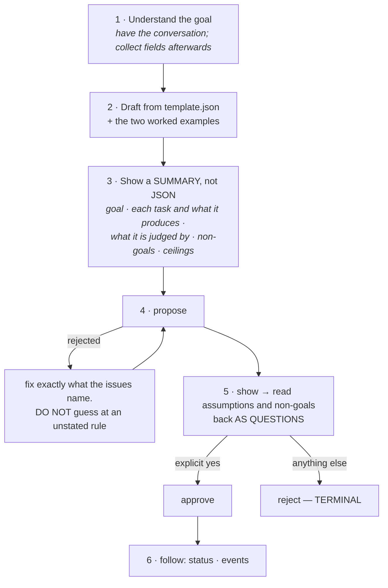

# Layer · Planning Client

> **Location:** `~/.claude/skills/plan/` — the operator's **global** Claude skills directory,
> deliberately **not in this repository**
> **Contents:** `SKILL.md`, `mycelium.mjs`, `template.json`, `examples/`

This is where all the thinking happens (G1). It is also the only tier that is a Claude session
rather than a service.

---

## 1 · Why it lives outside the repo

So that **any** Claude Code session can author and submit a plan, without a checkout of Mycelium
open. Its CLI talks to the orchestrator over HTTP and holds no copy of the schema.

> *"The MCP façade of §4 would make any MCP-capable client work; until it exists this is Claude
> Code."* A stdio shim wrapping the skill's six calls would restore that in about a hundred
> lines — it is named in the design and is not built.

---

## 2 · The workflow



Two instructions carry most of the weight:

> **Step 1:** *"Do not interrupt [the conversation] to collect fields; collect them afterwards
> from what was said. If the operator is still working out what they want, help with that first —
> a plan written from a half-formed goal wastes a whole environment finding that out."*

> **Step 5:** *"Read the assumptions and non-goals back to the operator **as questions**, not as a
> list to skim. The gate exists so a wrong assumption is caught here rather than three tasks in."*

**Step 3 is where a bad plan is cheapest to fix**, which is why the summary is prose rather than
JSON — an operator can judge "task 2 writes `findings.md`" and cannot judge a nested object.

---

## 3 · The rule that keeps the schema singular

> *"The schema is checked by the orchestrator, not by you. **Never write your own copy of
> `plan.schema.json`, and never validate against a remembered version of it** — submit the plan
> and read the issues that come back. That is the only arrangement in which your idea of the
> schema cannot quietly drift from the real one."*

And on rejections: *"Fix exactly what they name. **Do not guess at a rule the issues did not
state.**"* Every issue carries a JSON-Pointer path and a message, which is what makes that
workable.

This is the same anti-drift instinct that appears throughout the codebase — one validator, one
secret-key predicate shared by both guards, one roster emitted by the code that runs it.

---

## 4 · The CLI

```sh
node ~/.claude/skills/plan/mycelium.mjs <command>

  propose <file.json>   submit; prints the id, or every validation issue
  show    <plan-id>     what approval covers: assumptions, non-goals, ceilings, tasks
  approve <plan-id>
  reject  <plan-id>
  status  <plan-id>     plan and per-task state, spend, and the manifest once it ends
  events  <plan-id>     the event log for a plan
```

| Variable | Default |
| --- | --- |
| `MYCELIUM_URL` | the operator's Serve hostname |
| `MYCELIUM_OPERATOR` | the operator's Tailscale login; must be on the allowlist |

Both carry defaults, so the ordinary case needs no environment set at all.

`propose` is the only command with a body; the request sets `content-type` **only when there is
one**, because Fastify refuses an empty body that claims to be JSON.

**Three failures are named explicitly rather than surfacing as status codes** — an unreachable
orchestrator, an identity the allowlist does not carry, and a plan the schema rejected — *because
those are the three things that will happen, and each needs a different fix.*

### The identity caveat, stated in the skill itself

> The operator routes accept **loopback connections only** and take the caller's identity from a
> `Tailscale-User-Login` header. Serve injects that header having stripped any client-supplied
> copy, and **the loopback rule is what makes it trustworthy.** That is what happens against the
> default URL — which makes `MYCELIUM_OPERATOR` decorative there, since Serve substitutes the
> caller's real tailnet identity.
>
> Point `MYCELIUM_URL` at `http://127.0.0.1:8080` to reach a local orchestrator instead. **There
> is no Serve in that mode, so the header is self-asserted rather than proven** — acceptable on
> your own loopback, where there is nobody else, and not a deployment. *"Say so if the operator
> seems to think otherwise."*

---

## 5 · Guidance for writing a plan worth running

The skill's advice is worth reading as design commentary, because each rule maps to a mechanism.

| Rule | The mechanism behind it |
| --- | --- |
| **Small tasks, small feedback loops.** *"A task that cannot be verified without finishing two others is too big — split it."* | Each task gets its own cost ceiling, wall clock, and failure policy. A big task is an unbounded one |
| **Size limits to the task, not to the maximum.** *"`limits.cost_microusd` of $5.00 on a task that should cost a few cents is not headroom; it is an unbounded task with a number next to it."* Most small tasks land around **$0.30–$0.75** | The ceiling is what the SDK enforces, and it is what the plan-budget check reasons about |
| **Everything is microusd.** *Think in dollars, convert: $0.50 is `500000`* | `max_cost_microusd` is required and cannot be inferred — nothing holds a price table |
| **Criteria have to be checkable.** *"'A written comparison' becomes `findings.md`. 'Works well' is not a criterion."* | The orchestrator understands exactly two criterion types |
| **Non-goals are effectively required.** *"The agent is assumed prompt-injectable, and the non-goals are the only thing that bounds what it will treat as in scope."* | The schema permits an empty list; the dashboard's empty state reads *"Nothing bounds the agent's scope"* |
| **Assumptions carry their blast radius.** *What you are assuming, how confident you are, and what breaks if it is wrong* | *"That is what makes the approval gate useful rather than ceremonial"* |
| **Failure policy is a choice.** *"`retry` is for genuine flakiness… never for a task that failed because it was wrong. A wrong task retried three times is a wrong task three times."* | `halt` is the schema default |
| **Egress is deny-by-default.** *"`*.example.com` does **not** match the apex, so list both if you need both. A missing host fails at the proxy, visibly, mid-plan"* | The proxy's wildcard matching, exactly |
| **Rollback notes go in the description.** Any task touching something outside the plan branch says what undoing it looks like | Nothing enforces this — it is the operator's own discipline |

---

## 6 · What not to reach for

The skill lists the fields that **do not exist**, so an author does not invent one and get a
rejection:

cost budgets in dollars · spawn reserves · context capsules or typed references ·
`required_connections` for external APIs or MCP servers · model profiles · per-task `env` tiers ·
review-gate pause points · scheduled or recurring runs · agent-spawned subtasks.

> **A v1 task is a plain-text description; a v1 DAG is fixed at approval.**

---

## 7 · A worked example

The repository root carries a live smoke-test plan (gitignored). It is instructive precisely
because it is **internally inconsistent** — the goal names `HELLO.md`, the task writes
`HELLO-4.md`, and the success criterion checks for `HELLO-3.md`:

```json
{
  "goal": "The project repo contains a top-level HELLO.md with a single line of text.",
  "project": { "name": "first-plan-smoke" },
  "assumptions": ["High confidence: existing repo has a Hello.md."],
  "non_goals": ["Do not add or modify any other file.",
                "Do not add dependencies, CI, or tooling."],
  "env": "dev",
  "tasks": [{
    "id": "add-hello-v4",
    "description": "Create HELLO-4.md at the repo root containing exactly one line…",
    "depends_on": [],
    "limits": { "cost_microusd": 2500000, "wall_clock_min": 10 },
    "failure_policy": { "type": "halt" }
  }],
  "success_criteria": [{ "type": "file_exists_in_branch", "path": "HELLO-3.md" }],
  "egress": [],
  "max_cost_microusd": 2500000,
  "env_ttl_min": 60
}
```

**It is schema-valid and would fail its own criterion.** That is exactly the class of error the
schema *cannot* catch and step 3's plain-language summary *can* — a good argument for why that
step exists. The `-v4` / `PART 4` naming also shows it has been re-run several times against a
smoke run that has not yet succeeded.

---

*See also: [Contracts](contracts.md) · [02 · Flow of Use](../02-flow-of-use.md) · [07 · Evaluation](../07-evaluation.md)*
