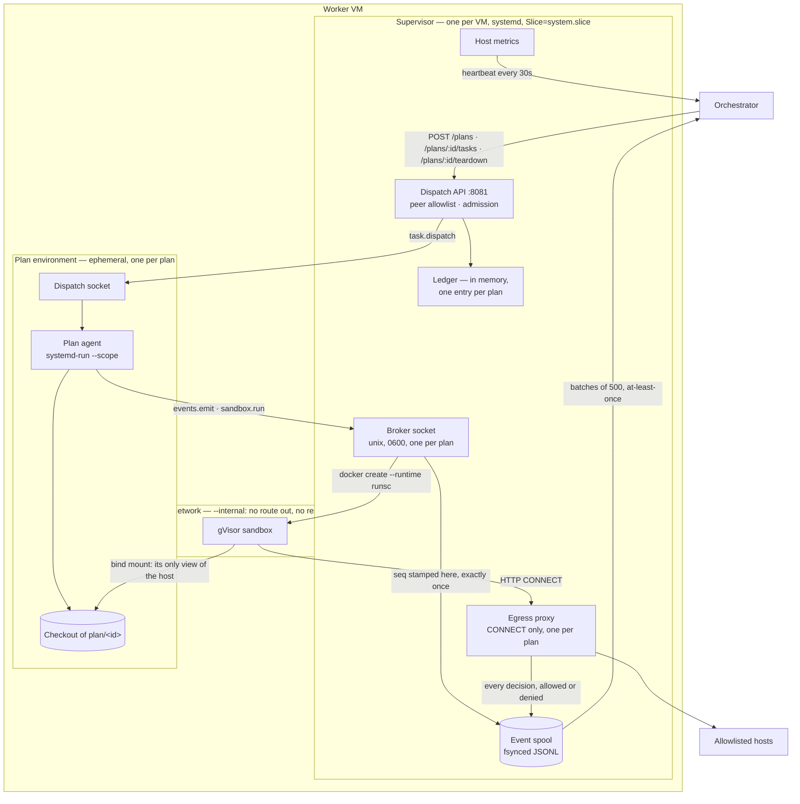
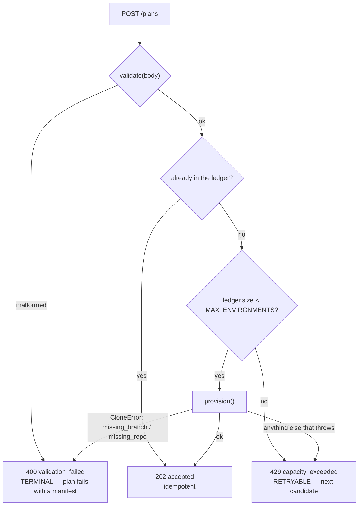
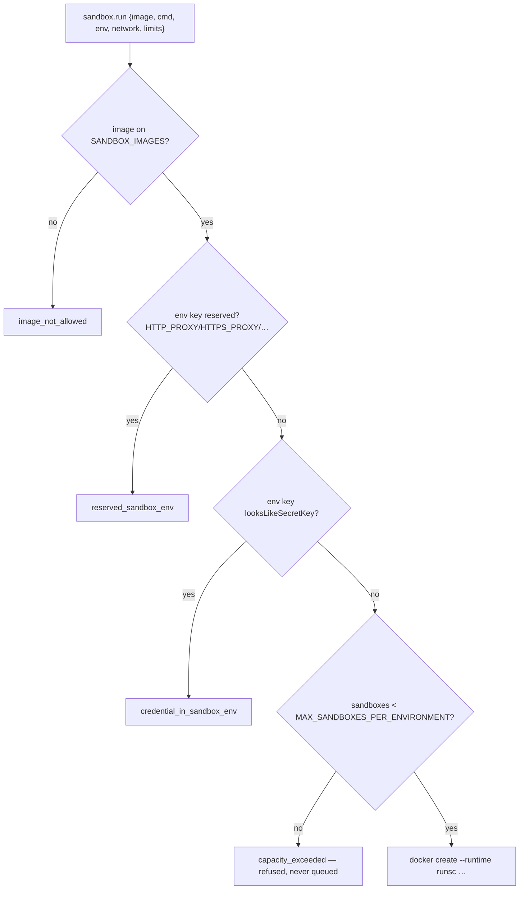
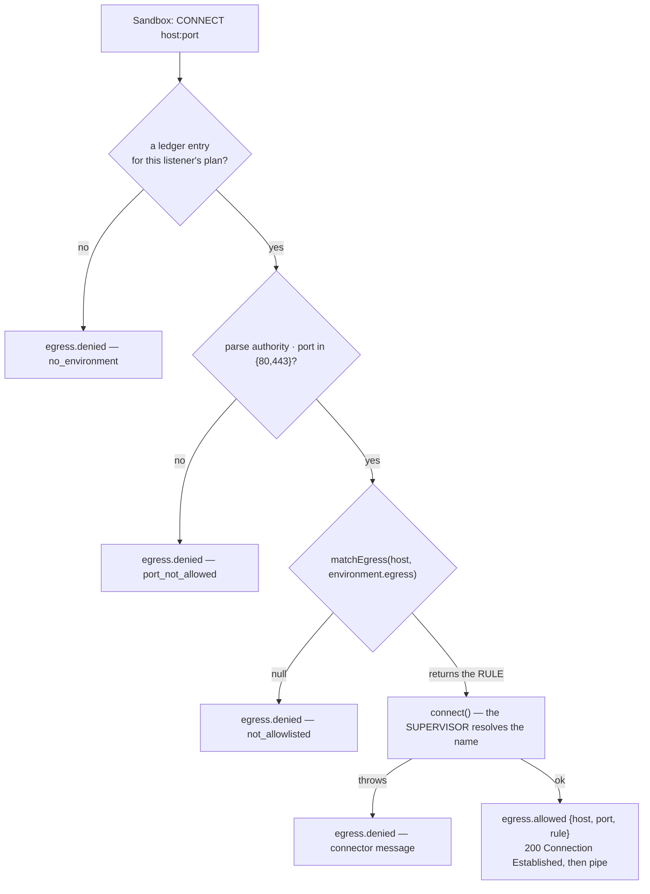
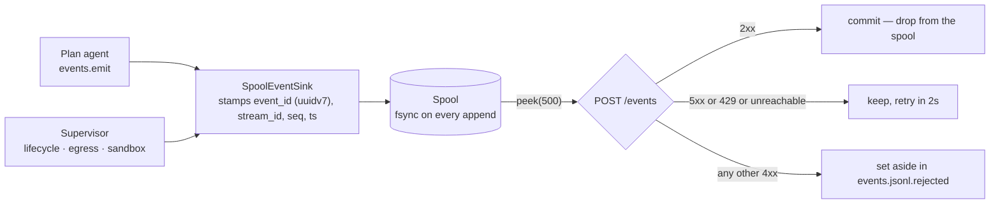
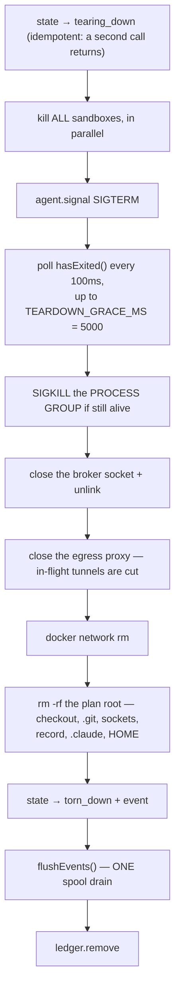
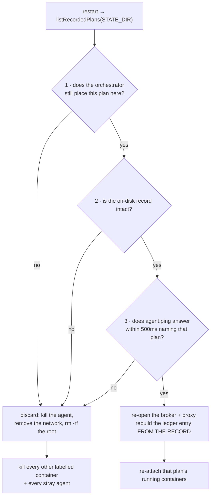

# Layer · Node Supervisor

> **Package:** `packages/supervisor` · **Stack:** Fastify 5, Node 22 ESM, uuid v7
> **Deployment:** one per worker VM, under systemd, as the unprivileged `mycelium` user
> **Trust tier:** trusted

The supervisor is **dumb infrastructure with a sharp perimeter**. It has no LLM loop and no
durable state beyond the event spool and one secret-free record per plan. Its job is to turn an
orchestrator's plan dispatch into a running, contained environment — and to take it away again.

---

## 1 · What it owns



**Three things in that picture are load-bearing rather than incidental:**

1. **Two one-way sockets, not one multiplexed both ways.** The agent *dials out* to the broker
   and *listens on* the dispatch socket, because a server cannot push.
2. **Sequence numbers are stamped in exactly one place** — the sink behind the broker — so an
   agent that restarts cannot reuse a number.
3. **The proxy is bound to its own plan's network gateway**, so which plan a request belongs to
   is decided by the socket it arrived on rather than by anything a sandbox could write into a
   header. The broker works the same way.

---

## 2 · The HTTP surface

Four routes. Three are behind a `preHandler` peer check registered in an encapsulated Fastify
scope; `/healthz` deliberately sits outside it.

| Method | Path | Success | Failures |
| --- | --- | --- | --- |
| `POST` | `/plans` | `202 {accepted: true}` | `403 peer_not_allowed`, `429 capacity_exceeded`, `400 validation_failed` |
| `POST` | `/plans/:id/tasks` | `202 {accepted: true}` | `403`, `409 no_environment`, `409 agent_not_accepting` |
| `POST` | `/plans/:id/teardown` | **always `204`** | none — failures are logged only |
| `GET` | `/healthz` | `200 {ok, environments, capacity, metrics}` | none, **not peer-guarded** |

The task route **forwards the envelope whole and reads nothing out of it**. When the agent
refuses, the agent's *own reason* is propagated into the 409 body — which is what lets the
orchestrator return the task to `ready` immediately rather than waiting out the lease.

Error bodies are `{code, message}` at the **top level**, deliberately unlike the orchestrator's
nested shape. This is load-bearing: the orchestrator's client reads `code` at the top level to
tell a terminal `validation_failed` from a retryable `capacity_exceeded`.

### Authentication is the tailnet peer address (B19)

```ts
const address = normaliseAddress(request.socket.remoteAddress);
if (address === null || !config.orchestratorPeers.includes(address)) {
  throw HttpError.forbidden('peer_not_allowed', …);
}
```

No token, no header, no TLS. A packet on the WireGuard interface cannot forge its source, so
this is real authentication rather than a convention — **but only while the process binds that
interface alone.** Two startup refusals enforce the premise:

| Condition | Message |
| --- | --- |
| `HOST` is `0.0.0.0` / `::` / `*` | *"…binds every interface and defeats the peer allowlist (B19). Bind the tailnet address."* |
| `ORCHESTRATOR_PEERS` empty | *"…which would authorise every caller (B19)"* |

IPv4-mapped IPv6 (`::ffff:100.64.0.1`) is normalised to the bare IPv4, because that is what
Node reports on a dual-stack socket. The observed address goes into the log, never the response.

---

## 3 · Admission: "full" vs "invalid"

The admission predicates are two one-line pure functions (`live < max`, never `!== max` — a
restart scan can leave `live > max`). What matters is how a failure is *classified*, because
that decides whether the orchestrator tries the next VM or gives up.



**Sticky placement makes the plan id a sufficient idempotency key** — the dispatch carries no
`dispatch_id` at all.

The `400`/`429` split is what makes B12's first-fit selection a *failover* mechanism rather than
just an optimisation: a transient clone failure, a network-creation failure, or an agent-start
failure all read as "this node could not provision" and the plan moves on. Only a plan that is
genuinely wrong — a branch or repo that does not exist — ends everywhere.

**Capacity is a static integer (B21).** Live headroom sampling is time-varying, awkward to test,
and can flap under the very memory pressure it is meant to detect. `MAX_ENVIRONMENTS` is a
deterministic input the operator can reason about, and the supervisor's rejection — not the
orchestrator's guess — is the correctness mechanism.

---

## 4 · Provisioning, step by step

Paths, all under `<STATE_DIR>/plans/<planId>/`:

```
repo/                     the checkout — agent cwd, file-tool root, sandbox bind mount
run/                      also the agent's HOME
  broker.sock             supervisor listens, agent dials  (0600)
  dispatch.sock           agent listens, supervisor dials
  environment.json        the secret-free record
  .claude/                CLAUDE_CONFIG_DIR — per plan
```

```mermaid
sequenceDiagram
    participant OR as Orchestrator
    participant SU as Supervisor
    participant GT as Gitea
    participant DK as Docker
    participant AG as Plan agent

    OR->>SU: POST /plans {plan_id, project, gitea{repo_url,branch,bot_token},<br/>orchestrator_token, egress[], env_ttl_min}
    SU->>SU: validate → admit → mkdir run/, repo/, run/.claude/
    SU->>GT: git clone --branch --depth 1 --single-branch<br/>(token via credential helper, never in the URL)
    SU->>DK: network create --internal --label mycelium.plan=&lt;id&gt;
    DK-->>SU: gatewayAddress
    SU->>SU: egress proxy listens ON THAT GATEWAY
    SU->>SU: broker socket listens (BEFORE the agent starts)
    SU->>AG: systemd-run --scope --slice=mycelium-plans<br/>--unit=mycelium-plan-&lt;id&gt;, detached, env injected
    SU->>SU: ledger.add(...)  ·  write environment.json LAST
    SU-->>OR: 202 accepted
    Note over OR: the plan goes 'running' on THIS answer,<br/>and tasks dispatch at once
```

Ordering that matters:

- **The broker socket opens before the agent starts**, so the agent's first call cannot race the
  socket into existence.
- **The reply goes out only once the agent is up**, because the orchestrator marks the plan
  `running` on the 202 and begins dispatching immediately.
- **The record is written last**, so a half-provisioned plan leaves no record claiming otherwise.

### What is injected into the agent — and what is not

Fourteen variables are injected as a **full environment replacement**, not an inheritance. This
is B13's whole point: the supervisor's *own* environment holds no secrets (they arrive via
`LoadCredentialEncrypted=` and are read from `$CREDENTIALS_DIRECTORY`), so there is nothing for a
child to inherit by accident. Three credentials are then placed deliberately:

| Credential | Source | Scope |
| --- | --- | --- |
| `ORCHESTRATOR_TOKEN` | the dispatch | the task-status route for this plan only |
| `GITEA_BOT_TOKEN` | the dispatch | repo-scoped; branch protection contains it |
| `MODEL_API_KEY` | `deps.secret('model_api_key')` | account-wide, with a provider-side spend limit behind it |

Also injected: `HOME` → `run/`, `CLAUDE_CONFIG_DIR` → `run/.claude/`, and
`MAX_CONCURRENT_SUBAGENTS`, derived by the supervisor from its **own** memory ceiling:

```ts
deriveMaxConcurrentSubagents(memoryMaxBytes)
//  undefined            → 2  (conservative, NOT the SDK's own default of 20)
//  ≤ 1 GiB usable       → 1
//  otherwise            → floor((memoryMaxBytes - 1 GiB) / 1 GiB), min 1
```

It is derived here rather than read from the plan because **the operator has no visibility into
the VM's memory** — only the supervisor knows the `MemoryMax` it sets on the scope.

### The unwind path

Any failure during provisioning runs a full unwind — remove from the ledger, close the broker,
close the proxy, remove the network, `rm -rf` the root — with **every step individually
`.catch()`ed**, then emits an `environment.state_changed` carrying `severity: 'warn'` and the
classified reason.

---

## 5 · The per-plan record — and what it deliberately omits

`run/environment.json` holds: `plan_id`, `root`, `workdir`, `network`, `gateway_address`,
`broker_socket`, `dispatch_socket`, `egress[]`, `ttl_expires_at`.

**It holds no secrets.** The three credentials are injected into a fresh agent at provision
time, and an adopted agent already has its own — *"writing them here would put three credentials
on disk for the lifetime of the VM to buy nothing."*

It exists because `GET /supervisors/:id/assignments` returns only plan id, state and project id
— not the egress list, the TTL, the network name, or the workdir. A restarted supervisor could
not rebuild a ledger entry from the orchestrator alone, and **an adopted plan with no egress list
is a plan whose proxy allows nothing.** The record is a cache of what dispatch already decided,
not a second source of truth. A record that fails its shape check reads as `null`, because a
half-written record from a mid-provision crash is worse than none.

---

## 6 · The sandbox broker

A per-plan AF_UNIX socket at `run/broker.sock`, **`chmod 0600`** — *"Owner-only. This is the
authorisation, so it is not decoration."*

> **B20 — why a unix socket, not localhost TCP.** Filesystem permissions *are* the
> authorisation, so the plan agent holds no credential pointing at the sandbox and B6's
> "credential-free toward the sandbox" stays literally true. A localhost port is reachable by
> anything sharing the network namespace and would need its own token — reintroducing exactly
> what B6 removed.

One JSON request per connection, one response, close. A request completes on either a newline
byte or `'end'`, guarded by a `handled` latch — *an `events.emit` run twice would be two
events*. Over 1 MiB → `request_too_large` and the socket is destroyed.

### `events.emit`

| Check | Rejection |
| --- | --- |
| `type` in the 15 contract event types | `invalid_event` |
| every payload key against `looksLikeSecretKey` | `secret_in_payload` |

`planId` comes from **the socket the request arrived on, never from the body**. The redaction
predicate is imported from `@mycelium/contracts` and shared with the orchestrator's ingest guard,
so the two cannot disagree and wedge the spool.

### `sandbox.run`

Checked in order: `image` + non-empty `cmd` → the node's **image allowlist** → per-key env checks
→ per-plan sandbox capacity.



**The allowlist is validated supervisor-side** because *"an allowlist the agent could edit would
not be one."* Resource requests are clamped, never trusted: `cpus` and `memory_mb` clamp against
their own configured defaults; `timeout_sec` defaults to `SANDBOX_TIMEOUT_SEC` (300) but clamps
against `SANDBOX_TIMEOUT_CEILING_SEC` (3600).

### The container, flag by flag

```
docker create --runtime runsc --label mycelium.plan=<id>
  --network <plan network | none>
  --read-only --tmpfs /tmp:rw,noexec,nosuid,size=512m
  --cap-drop ALL --security-opt no-new-privileges
  --cpus <n> --memory <n>m --workdir /workspace
  --mount type=bind,source=<checkout>,target=/workspace
  <image> <cmd…>
```

*"Every flag is a security property, not a preference — which is why none of them can be reached
from the RPC parameters."*

The container is **created before it is started**, so the id exists before anything runs and
teardown can always find the container it is racing.

### Output is capped twice

1. **Capture cap** in the driver (`OUTPUT_MAX_BYTES`, 10 MiB): bytes past it are counted and
   discarded in flight.
2. **head/tail cap** before the result reaches the agent (`OUTPUT_HEAD_BYTES` + `OUTPUT_TAIL_BYTES`,
   8 KiB each), rendered as `head …[N bytes omitted]… tail`.

`bytes` is always the **observed** size, not the preview size — and the agent's `sandbox` tool
says so in words to the model, because *a model that thinks it read all of the output will draw
conclusions from the half it got.*

---

## 7 · The egress proxy

Default deny, `CONNECT` only, ports 80 and 443 only.



**A plain (non-CONNECT) request is answered `405 {\"code\":\"connect_only\"}`** — a proxied
request would let the sandbox send a body this process would have to read.

### Matching semantics

| Rule | Matches | Does **not** match |
| --- | --- | --- |
| `example.com` | `example.com` | `a.example.com` |
| `*.example.com` | `a.example.com`, `a.b.example.com` | **`example.com`** (the apex) |
| `*` or `*.` | *not a valid rule* | — B14 refuses an unrestricted mode |

- **An IP literal is never a match.** `normaliseHost` returns `null` for IPv4 literals, IPv6
  literals, embedded ports, paths, schemes and whitespace — an address would otherwise slip past
  a list of names.
- **`matchEgress` returns the rule that permitted the request, not a boolean**, because every
  allowed request is an event that records *which rule let it through*.
- **The proxy resolves the name**, in the supervisor's namespace. The sandbox has no resolver, so
  there is no DNS side channel.

### The list is frozen at dispatch

```ts
egress: [...config.standingEgress, ...dispatch.egress.map(e => e.toLowerCase())]
```

Merged **once**, into the ledger entry. The proxy reads only `environment.egress` and never
consults configuration, *"so a plan's list cannot be widened after it was approved."* On
adoption after a restart, the list comes from the on-disk record verbatim.

The standing set defaults to the package registries and must, in production, also name the model
API host and the Gitea host — a bring-up finding: without `api.anthropic.com` the agent runs but
every model call fails.

**What an event records:** `{host, port, rule}` on allow; `{host, port, rule: null, reason}` on
deny. *"Never a URL path, a header, or a byte of the body."*

---

## 8 · The event pipeline



**Why the 4xx branch exists.** An orchestrator that is *down* is transient and the spool waits —
that is what the spool is for. An orchestrator that *refused* a batch has found an emitter bug,
which no amount of retrying fixes and which would otherwise wedge every later event behind it.
So the batch is set aside and the drain continues.

| Property | Mechanism |
| --- | --- |
| Stream id | `agent:<planId>` or `supervisor:<supervisorId>` |
| Durability | `handle.sync()` — a real fsync, not an OS buffer |
| Crash-safe truncate | rewrite-to-`.tmp` then `rename()` |
| Overflow (1 GiB default) | **drop oldest** — losing the newest would hide whatever is currently going wrong |
| A drop is visible | a marker event `{code: 'events_dropped', dropped_from_seq, dropped_to_seq, dropped_count}` is appended on the supervisor's own stream, so a sequence gap reads as a full disk rather than as lost events |
| Batch size | 500 — the orchestrator's own cap; sending more is a guaranteed 400 |

### Sequence numbers refuse to guess

`SeqCounters.next()` **throws before reconciliation has run**:

> *"refusing to assign a sequence number before reconciliation: a truncated spool cannot prove
> how far this stream got"*

The spool has already dropped whatever the orchestrator acknowledged, so neither side alone
knows how far a stream got. Recovery takes **the higher of the two** — the spool's own marks and
the orchestrator's high-water marks. Until that has happened no number is issued at all, because
*a supervisor that guessed would be reporting an emitter bug it had caused itself.*

---

## 9 · Teardown

Called at most once by the orchestrator, whose `authorizeTeardown` **ignores its response
status**. So teardown must not be able to fail: every step is individually `.catch()`ed.



**Sandboxes die first**, before the agent, so nothing is left running against a checkout that is
about to be deleted. **The drain at step 10 is why the agent's terminal event ever reaches the
operator** — the agent posts it to the local spool in milliseconds, and this is what pushes it
off the VM before the plan is forgotten.

> **B15 — five seconds, uniform across triggers.** Events reach the fsynced spool over a local
> socket with no agent-side buffering, so a flush needs milliseconds and 5 s is generous. The
> window exists to *guarantee a terminal event*: a plan that goes silent on cancel or TTL is the
> case you most need to debug, and silence is the one thing a hard kill cannot fix.

### The TTL backstop

A 30-second sweep (the one hard-coded loop interval) tears down any `running` environment past
`ttl_expires_at + TTL_GRACE_MIN`. It exists precisely because `authorizeTeardown` ignores its
response: a single dropped authorization would otherwise leak an environment until reboot. The
grace gives the orchestrator first refusal.

### Killing means killing the group

The agent is spawned `detached`, giving it its own process group, and wrapped in
`systemd-run --scope --slice=mycelium-plans --unit=mycelium-plan-<id>`. Kills go to
`process.kill(-pid, …)` — *"the negative pid is the point: it signals the group, not just the
leader"* — or, for an **adopted** agent with no child object, to
`systemctl kill --signal=… --kill-whom=all mycelium-plan-<id>.scope`.

> ⚠️ **`AGENT_SLICE` is not optional.** With no configured slice, `signalScope` returns
> silently — there is nothing to signal — and an orphaned agent outlives its supervisor until
> the VM is rebooted. This is also the sole enforcement of B15's five seconds, because the Agent
> SDK's own teardown timers are `.unref()`'d and can orphan the `claude` subprocess.

---

## 10 · Restart reconciliation

A deploy no longer ends every plan on the VM. Adoption needs **all three** conditions:



*"Anything short of that is killed and fails back to its last pushed commit, because a plan that
looks alive and answers nothing is the worse outcome."*

Two details worth knowing:

- **A running container whose plan was adopted is re-attached, not killed** — its agent is still
  waiting on it, and killing it would fail a task that was about to succeed.
- **If the orchestrator is unreachable, nothing is adopted and nothing is emitted.** The VM is
  still cleaned, and `main()` retries every 10 seconds until it is armed. A supervisor that
  guessed a sequence number would be reporting an emitter bug it had caused itself.

Discovery starts **from disk**, not from the process table — which is why the record exists.

---

## 11 · Heartbeat & metrics

Every `HEARTBEAT_INTERVAL_MS` (default 30 s) → `POST /supervisors/:id/heartbeat`. Two minutes of
silence marks the VM unhealthy orchestrator-side and it stops receiving dispatch; five minutes
fails the plans running on it.

`heartbeatOnce` **never throws**, and metrics collection has its own inner try/catch — *a thrown
heartbeat is a VM that stops receiving work.* Metrics failure still sends the heartbeat.

| Group | Fields |
| --- | --- |
| CPU | `cpu_count`, `load_1`, `load_5`, `load_15`, `cpu_saturation` (= `load_1 / cpu_count`) |
| Memory | `mem_total_mb`, `mem_available_mb`, `mem_used_pct` |
| Disk | `disk_total_mb`, `disk_free_mb`, `disk_used_pct` — **all three nullable together** |
| Ledger | `environments`, `environment_capacity`, `sandboxes` |
| Meta | `uptime_sec`, `version` |

`mem_available_mb` prefers `/proc/meminfo`'s `MemAvailable` over `os.freemem()`, because
`freemem()` excludes reclaimable page cache and a healthy Linux VM would read 85–95 % used. Disk
failure nulls **only** the disk fields; a nonsensical total returns `null` rather than 100 %.

The same collector backs `GET /healthz`, *"so what the operator curls and what the dashboard
renders cannot disagree."* Environment and sandbox counts come from the in-memory ledger — the
supervisor's own view, not a verified scan of the VM, which is why the dashboard labels them
`(reported)`.

---

## 12 · Configuration reference

| Env var | Default | Notes |
| --- | --- | --- |
| `SUPERVISOR_ID` | **required** | |
| `ORCHESTRATOR_URL` | **required** | trailing `/` stripped |
| `ORCHESTRATOR_PEERS` | **required, non-empty** | comma list; empty is refused |
| `HOST` | **required** | wildcard refused unless `ALLOW_INSECURE_BIND=1` (tests only) |
| `PORT` | `8081` | |
| `STATE_DIR` | `/var/lib/mycelium` | |
| `MAX_ENVIRONMENTS` | `2` | B21 |
| `MAX_SANDBOXES_PER_ENVIRONMENT` | `4` | |
| `SANDBOX_IMAGES` | `[]` | **empty means nothing runs** |
| `SANDBOX_CPUS` / `SANDBOX_MEMORY_MB` | `1` / `1024` | memory min 64 |
| `SANDBOX_TIMEOUT_SEC` / `SANDBOX_TIMEOUT_CEILING_SEC` | `300` / `3600` | request clamps to the ceiling |
| `AGENT_MEMORY_MAX_BYTES` | *unset* | feeds both the scope's `MemoryMax` and `MAX_CONCURRENT_SUBAGENTS` |
| `OUTPUT_HEAD_BYTES` / `OUTPUT_TAIL_BYTES` / `OUTPUT_MAX_BYTES` | `8192` / `8192` / `10 MiB` | |
| `STANDING_EGRESS` | npm, PyPI, files.pythonhosted | **setting it replaces the default set entirely** |
| `HEARTBEAT_INTERVAL_MS` / `RELAY_INTERVAL_MS` | `30000` / `2000` | |
| `SPOOL_MAX_BYTES` | 1 GiB | |
| `TEARDOWN_GRACE_MS` / `TTL_GRACE_MIN` | `5000` / `5` | B15 |
| `AGENT_COMMAND` | — | read in `index.ts`, not `loadConfig`; space-split argv |
| `AGENT_SLICE` | — | **effectively required in production** (see §9) |

---

## 13 · Testing posture (B22)

Everything ships behind a driver interface with an in-memory fake, and the default `pnpm test`
run needs no Docker, no Postgres, and no network. The reasoning is explicit: *the supervisor's
bugs live in its admission, lifecycle and teardown logic, and those are testable without a
container runtime — and gVisor does not run on the operator's Windows machine, so mandating real
containers everywhere would produce a suite the operator cannot run.*

Two opt-in Linux suites cover what a fake cannot prove:

| Suite | Gate | Proves |
| --- | --- | --- |
| Docker / gVisor | `SUPERVISOR_DOCKER_TESTS=1` | runs under gVisor not the host kernel; read-only root; sees the checkout and nothing else; **no route off the host**; *does* reach the gateway where the proxy sits; the wall clock kills it; nothing is left behind |
| systemd scopes | `SUPERVISOR_SYSTEMD_TESTS=1` | a kill reaches a **grandchild**, via both `killGroup` and `systemctl kill --kill-whom=all` |

The git driver suite runs itself only if `git` is on `PATH`, and splits: a real `file://` repo
for behaviour, plus an injected fake `exec` to inspect the exact argv and environment handed to
git for the `http://` case — because a file URL cannot carry credentials and so could never
prove the token handling.

---

*See also: [Guardrails](../06-guardrails.md) · [Observability](../08-observability.md) · [Infrastructure](infrastructure.md)*
